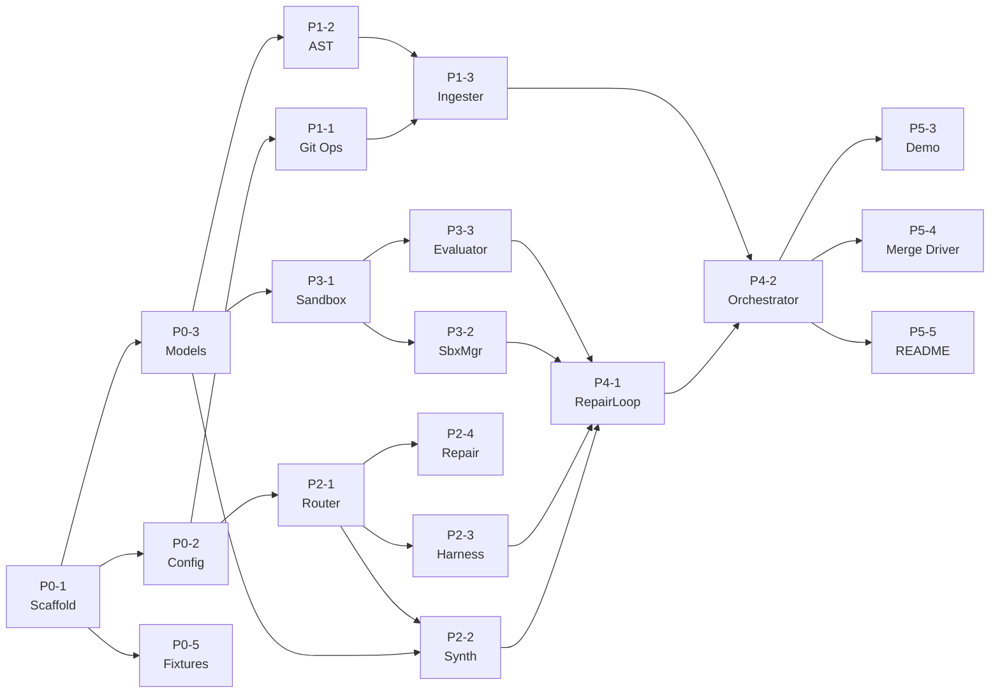

# PROJECT_SPEC.md: Semantic Merge-Conflict Resolver with Differential Verification

> **Project Codename:** `git-merger`
> **Track:** Nebius × NVIDIA Global AI Hackathon — Coding and Agentic Engineering
> **Runtime Target:** Python 3.11+ | pytest | hypothesis
> **Models:** NVIDIA Nemotron 3 Ultra 550B (55B active, Hybrid Mamba-Transformer MoE) · Nemotron 3 Super 120B (12B active) · Nemotron 3 Nano 30B (3B active)
> **Infrastructure:** Nebius Token Factory (inference) + Nebius ConTree Sandboxes (code execution)

---

## Table of Contents

1. [Executive Summary & Problem Scope](#1-executive-summary--problem-scope)
2. [Technical Prerequisites & Research Roadmap](#2-technical-prerequisites--research-roadmap)
3. [System Architecture & Component Topology](#3-system-architecture--component-topology)
4. [Model Routing & Prompt Engineering Protocols](#4-model-routing--prompt-engineering-protocols)
5. [Nebius Sandbox Lifecycle & Execution Protocol](#5-nebius-sandbox-lifecycle--execution-protocol)
6. [End-to-End State Machine & Algorithmic Workflow](#6-end-to-end-state-machine--algorithmic-workflow)
7. [Architect's Extension Layer](#7-architects-extension-layer)
8. [Benchmark Conflict Scenarios](#8-benchmark-conflict-scenarios)
9. [Phased Build Plan & Agent Task Delegation Matrix](#9-phased-build-plan--agent-task-delegation-matrix)

---

## 1. Executive Summary & Problem Scope

### 1.1 The Semantic Merge Failure Problem

Standard Git merge operates on **line-based textual differencing** (the `diff3` algorithm). When two branches modify the same region of a file, Git produces conflict markers (`<<<<<<<`, `=======`, `>>>>>>>`). When changes fall on *different* lines, Git auto-merges silently—even if the result is **semantically broken**.

**Categories of silent semantic failure:**

| Failure Class | Example | Git Behavior |
|---|---|---|
| **Signature/Body Mismatch** | Branch A changes `def f(x)` → `def f(x, strict=False)`. Branch B adds a nil-check inside `f`'s body. | Auto-merges cleanly. Body still calls old signature semantics. |
| **Concurrent Extension Collision** | Both branches add entries to a dispatch `dict`. | Auto-merges cleanly. Duplicate keys silently overwrite. |
| **Invariant Inversion** | Branch A changes `<` to `<=` in validation. Branch B adds error handling assuming `<` semantics. | Auto-merges cleanly. Error handler never triggers for boundary case. |

Naive LLM-assisted resolvers ("just paste both sides into GPT") produce **union merges** that superficially compile but silently drop security patches, nil-pointer guards, or boundary conditions.

### 1.2 Our Solution: Differential Verification

We build an **autonomous coding agent** that:

1. **Ingests** the full 3-way merge context (base, ours, theirs) plus commit metadata.
2. **Synthesizes** a candidate resolution `M*` using semantic intent analysis via Nemotron Ultra.
3. **Generates** a property-based differential test harness via Nemotron Nano/Super.
4. **Executes** the harness in parallel Nebius Sandboxes against Branch A, Branch B, and `M*`.
5. **Repairs** `M*` iteratively if differential tests fail, feeding failure traces back to Ultra.
6. **Commits** the verified resolution with an explainable provenance report.

### 1.3 Hackathon Track Alignment

The **Coding and Agentic Engineering Track** judging rubric rewards:

| Rubric Criterion | Our Alignment |
|---|---|
| **Technical Innovation** | AST-guided semantic merge with formal differential verification—no existing Python tool does this. |
| **Agentic Workflow** | Full closed-loop autonomy: synthesize → test → repair → commit. Zero human intervention for solvable conflicts. |
| **Use of NVIDIA Models** | Tiered routing across Ultra/Super/Nano with structured JSON output contracts. |
| **Use of Nebius Infrastructure** | Parallel sandbox execution for isolated differential testing. |
| **Practical Utility** | Drop-in Git merge driver / CI integration. Real-world merge conflict scenarios. |
| **Demo Quality** | Three deterministic benchmark scenarios with live differential test execution. |

---

## 2. Technical Prerequisites & Research Roadmap

### 2.1 Git Internals

#### 2.1.1 Three-Way Merge & Merge Base Computation

```
         O (merge base)
        / \
       /   \
      A     B
       \   /
        \ /
        M* (candidate merge)
```

- **`git merge-base A B`**: Finds the best common ancestor commit reachable from both `A` and `B` using Lowest Common Ancestor (LCA) in the commit DAG.
- **`git merge-base --all A B`**: For criss-cross merges, returns all merge bases. Git's `ort` strategy (default since 2.34) recursively merges the bases themselves to produce a "virtual merge base."

**Key commands for context extraction:**

```bash
# Get merge base commit
BASE=$(git merge-base branch_a branch_b)

# Extract file versions
git show $BASE:path/to/file.py > base.py
git show branch_a:path/to/file.py > ours.py
git show branch_b:path/to/file.py > theirs.py

# Get commit messages for intent extraction
git log $BASE..branch_a --oneline --no-merges -- path/to/file.py
git log $BASE..branch_b --oneline --no-merges -- path/to/file.py

# Get diffs
git diff $BASE branch_a -- path/to/file.py > diff_a.patch
git diff $BASE branch_b -- path/to/file.py > diff_b.patch
```

#### 2.1.2 diff3 Algorithm (Line-Based 3-Way Merge)

1. Compute `diff(O, A)` and `diff(O, B)` as sequences of edit operations.
2. For each region of the file:
   - **Only A changed** → accept A.
   - **Only B changed** → accept B.
   - **Both changed identically** → accept either.
   - **Both changed differently** → emit CONFLICT markers.

**Limitation:** This is purely textual. Two changes on adjacent (but different) lines merge cleanly even if they are semantically incompatible.

#### 2.1.3 AST Parsing vs. Line-Based Diffing

| Dimension | Line-Based (diff3) | AST-Based (Our Approach) |
|---|---|---|
| Granularity | Text lines | Syntax nodes (functions, classes, statements) |
| Formatting sensitivity | High (whitespace = diff) | None (structure-only) |
| Semantic awareness | None | Detects structural conflicts |
| Language dependency | None | Requires parser for target language |

### 2.2 Python AST Toolchain

#### Core `ast` Module Operations

```python
import ast
import textwrap

def extract_functions(source: str) -> dict[str, ast.FunctionDef]:
    """Parse source and return a dict of function_name -> AST node."""
    tree = ast.parse(source)
    return {
        node.name: node
        for node in ast.walk(tree)
        if isinstance(node, (ast.FunctionDef, ast.AsyncFunctionDef))
    }

def get_function_source(source: str, node: ast.FunctionDef) -> str:
    """Extract the source code of a specific function node."""
    return ast.get_source_segment(source, node)

def get_signature(node: ast.FunctionDef) -> dict:
    """Extract function signature as a comparable dict."""
    return {
        "name": node.name,
        "args": [a.arg for a in node.args.args],
        "defaults": [ast.dump(d) for d in node.args.defaults],
        "kwonly": [a.arg for a in node.args.kwonlyargs],
        "kw_defaults": [ast.dump(d) if d else None for d in node.args.kw_defaults],
        "vararg": node.args.vararg.arg if node.args.vararg else None,
        "kwarg": node.args.kwarg.arg if node.args.kwarg else None,
        "returns": ast.dump(node.returns) if node.returns else None,
        "decorators": [ast.dump(d) for d in node.decorator_list],
    }

def diff_functions(base_src: str, branch_src: str) -> dict[str, str]:
    """Compare function signatures between base and branch."""
    base_fns = extract_functions(base_src)
    branch_fns = extract_functions(branch_src)
    result = {}
    for name in set(base_fns) | set(branch_fns):
        if name not in base_fns:
            result[name] = "added"
        elif name not in branch_fns:
            result[name] = "removed"
        elif ast.dump(base_fns[name]) != ast.dump(branch_fns[name]):
            result[name] = "modified"
    return result
```

#### Recommended Libraries

| Library | Purpose | Notes |
|---|---|---|
| `ast` (stdlib) | Parse Python to AST, unparse back | Python 3.9+ for `ast.unparse()` |
| `tree-sitter` + `py-tree-sitter` | Incremental concrete syntax tree parser | Language-agnostic, faster than `ast` for large files |
| `diffsitter` | Structural diff using tree-sitter | Rust CLI, can invoke as subprocess |
| `GumTree` | AST diff with edit scripts | Java-based, overkill for hackathon scope |

### 2.3 Differential Testing & Property-Based Testing

#### 2.3.1 Differential Testing Paradigm

**Principle:** Given two or more implementations of the same specification, execute them on the same inputs. Any output divergence indicates a bug in at least one implementation.

**Application to merge resolution:**

```
For each generated input I:
    result_base = execute(base_version, I)
    result_a    = execute(branch_a_version, I)
    result_b    = execute(branch_b_version, I)
    result_m    = execute(candidate_M*, I)

    # Where A changed behavior from Base, M* must match A
    if result_a != result_base:
        assert result_m == result_a, "M* dropped Branch A's change"

    # Where B changed behavior from Base, M* must match B
    if result_b != result_base:
        assert result_m == result_b, "M* dropped Branch B's change"

    # Where neither changed, M* must match Base
    if result_a == result_base and result_b == result_base:
        assert result_m == result_base, "M* introduced spurious change"
```

**Edge case — both branches changed the same behavior:**
This is a true semantic conflict. The agent must detect this and either:
- Choose the "dominant" change based on intent analysis, or
- Escalate to human review.

#### 2.3.2 Property-Based Testing with `hypothesis`

```python
from hypothesis import given, strategies as st, settings, HealthCheck

# Strategy: generate inputs matching the function's parameter types
@given(data=st.one_of(
    st.none(),
    st.lists(st.integers(min_value=-1000, max_value=1000), max_size=50),
    st.lists(st.floats(allow_nan=False, allow_infinity=False), max_size=50),
))
@settings(max_examples=200, deadline=None, suppress_health_check=[HealthCheck.too_slow])
def test_differential_process(data):
    """M* must preserve behavioral invariants of both branches."""
    from base_version import process as process_base
    from branch_a_version import process as process_a
    from branch_b_version import process as process_b
    from candidate_version import process as process_m

    try:
        r_base = process_base(data)
    except Exception as e_base:
        r_base = type(e_base).__name__

    try:
        r_a = process_a(data)
    except Exception as e_a:
        r_a = type(e_a).__name__

    try:
        r_b = process_b(data)
    except Exception as e_b:
        r_b = type(e_b).__name__

    try:
        r_m = process_m(data)
    except Exception as e_m:
        r_m = type(e_m).__name__

    # Differential assertions
    if r_a != r_base and r_b == r_base:
        assert r_m == r_a, f"M* lost Branch A behavior: expected {r_a}, got {r_m}"
    elif r_b != r_base and r_a == r_base:
        assert r_m == r_b, f"M* lost Branch B behavior: expected {r_b}, got {r_m}"
    elif r_a != r_base and r_b != r_base:
        # Both changed — M* should incorporate both or match the synthesized intent
        assert r_m == r_a or r_m == r_b, f"M* diverged from both branches"
```

### 2.4 NVIDIA Model Ecosystem

#### Model Tier Selection Matrix

| Model | ID | Params (Total/Active) | Architecture | Context | Use In Our System |
|---|---|---|---|---|---|
| **Nemotron 3 Ultra** | `nvidia/nemotron-3-ultra-550b-a55b` | 550B / 55B active | Hybrid Mamba-2 + Transformer LatentMoE, Multi-Token Prediction | 1M tokens | Intent analysis, code synthesis, repair loop |
| **Nemotron 3 Super** | `nvidia/nemotron-3-super-120b-a12b` | 120B / 12B active | Hybrid Mamba-2 + Transformer MoE (distilled from Ultra) | 256K–1M tokens | Test harness generation, structured extraction |
| **Nemotron 3 Nano** | `nvidia/nemotron-3-nano-30b-a3b` | 30B / 3B active | Hybrid Mamba-2 + Transformer MoE (sparse) | 256K tokens | Log parsing, classification, quick reformatting |

#### API Access Pattern

```python
from openai import OpenAI

# Nebius Token Factory — OpenAI-compatible endpoint hosting NVIDIA Nemotron models
client = OpenAI(
    base_url="https://api.studio.nebius.ai/v1",  # or https://api.tokenfactory.nebius.com/v1
    api_key=os.environ["NEBIUS_API_KEY"],
)

def call_nemotron(
    model: str,
    system_prompt: str,
    user_prompt: str,
    json_mode: bool = True,
    temperature: float = 0.1,
    max_tokens: int = 8192,
) -> dict | str:
    response = client.chat.completions.create(
        model=model,
        messages=[
            {"role": "system", "content": system_prompt},
            {"role": "user", "content": user_prompt},
        ],
        temperature=temperature,
        max_tokens=max_tokens,
        response_format={"type": "json_object"} if json_mode else None,
    )
    content = response.choices[0].message.content
    return json.loads(content) if json_mode else content
```

#### Why Hybrid Mamba-Transformer LatentMoE for Ultra?

The Nemotron 3 Ultra 550B architecture combines Mamba-2 (Selective State Space Model) layers with Transformer attention MoE layers and LatentMoE routing:
- **O(n) inference** via Mamba-2 layers for long sequences (vs. O(n²) for pure attention), with only 55B of 550B parameters active per token.
- **No KV-cache blowup** — Mamba layers maintain constant-memory state, critical for our repair loop which may run 3–5 iterations each accumulating prior context.
- **1M token context window** — stable quality at extreme context lengths without degradation, enabling full-file merge context with commit histories.
- **Multi-Token Prediction (MTP)** — native speculative decoding predicts multiple future tokens per forward pass, accelerating structured JSON generation.
- **LatentMoE routing** — tokens are projected into a lower-dimensional latent space before expert dispatch, reducing inter-node communication overhead.

### 2.5 Nebius Platform & Sandbox Architecture

#### 2.5.1 Nebius Token Factory (Inference)

Nebius Token Factory is the managed inference platform:
- **Model Catalog:** 60+ open-source models including the full NVIDIA Nemotron 3 family (Nano 30B, Super 120B, Ultra 550B).
- **Throughput:** >100M tokens/minute with sub-second response times and 99.9% uptime SLA.
- **Optimizations:** KV caching, paged attention, speculative decoding, continuous batching.
- **API:** 100% OpenAI-compatible at `https://api.studio.nebius.ai/v1`.
- **Features:** Streaming, tool/function calling, structured JSON output (`json_schema` response format), safety guardrails.

#### 2.5.2 Nebius ConTree Sandboxes (Code Execution)

Nebius ConTree is a purpose-built execution environment for autonomous AI agents with **Git-like branching and filesystem snapshotting**:

- **VM-Level Isolation:** Unlike Docker containers, sandboxes run in hardware-isolated VMs. Container-like spin-up times (<1s) despite VM-level security.
- **OCI Compatible:** Pull base images from Docker Hub, GHCR, or use Nebius's 7,000+ pre-warmed SWE environments.
- **Immutable Checkpoints:** Every execution step generates a new immutable filesystem snapshot—enabling rollback and branching.
- **Execution Branching:** Fork from any checkpoint to test multiple strategies concurrently (critical for our differential A/B/M* evaluation).
- **Zero-Cost Rollback:** Discard failing branches and revert to parent checkpoint with a single API call.

**ConTree SDK for Python (`contree-sdk`):**

```python
# pip install contree-sdk
from contree_client.httpx import ContreeClient
from contree_sdk import ContreeSync

# Authenticate from ~/.config/contree/auth.ini or environment
with ContreeClient.from_profile() as api_client:
    contree = ContreeSync(api_client)

    # List available images
    images = contree.images()
    base_image = images[0]

    # Run a command in an isolated sandbox
    operation = base_image.run(shell="python -m pytest tests/ -v --tb=long")
    result = operation.wait()
    print("Exit code:", result.exit_code)
    print("Stdout:", result.stdout)
    print("Stderr:", result.stderr)
```

**ConTree CLI (`contree`):**

```bash
# Launch sandbox from image
contree run <image_id>

# Interactive shell
contree shell <sandbox_id>

# File operations (bidirectional)
contree cp local_file.py <sandbox_id>:/workspace/file.py
contree cp <sandbox_id>:/workspace/output.json ./output.json
contree cat <sandbox_id>:/workspace/result.txt

# List/inspect operations
contree ps                           # List active sandboxes
contree op show <operation_id>       # Check stdout, stderr, exit code
```

**ConTree Config (`~/.config/contree/auth.ini`):**

```ini
[profile:default]
type = iam
url = https://api.tokenfactory.nebius.com/sandboxes
token = <YOUR_AUTH_TOKEN>
project = <YOUR_NEBIUS_PROJECT_ID>
```

#### 2.5.3 Sandbox Abstraction Layer

> **Design Decision:** We design against an abstraction interface that can be backed by Nebius ConTree (primary), E2B, Modal, or local Docker containers for development.

```python
from abc import ABC, abstractmethod
from dataclasses import dataclass
from enum import Enum

class SandboxStatus(Enum):
    PROVISIONING = "provisioning"
    READY = "ready"
    EXECUTING = "executing"
    COMPLETED = "completed"
    FAILED = "failed"
    TIMED_OUT = "timed_out"
    DESTROYED = "destroyed"

@dataclass
class ExecutionResult:
    exit_code: int
    stdout: str
    stderr: str
    duration_ms: int
    timed_out: bool

@dataclass
class SandboxSpec:
    python_version: str = "3.11"
    memory_mb: int = 512
    timeout_seconds: int = 60
    pip_packages: list[str] = None

    def __post_init__(self):
        if self.pip_packages is None:
            self.pip_packages = ["pytest", "hypothesis"]

class SandboxProvider(ABC):
    @abstractmethod
    async def create(self, spec: SandboxSpec) -> str:
        """Provision a sandbox. Returns sandbox_id."""
        ...

    @abstractmethod
    async def upload_files(self, sandbox_id: str, files: dict[str, str]) -> None:
        """Upload files to sandbox. files = {path: content}."""
        ...

    @abstractmethod
    async def execute(self, sandbox_id: str, command: str) -> ExecutionResult:
        """Execute a command in the sandbox."""
        ...

    @abstractmethod
    async def destroy(self, sandbox_id: str) -> None:
        """Tear down the sandbox."""
        ...

    @abstractmethod
    async def snapshot(self, sandbox_id: str) -> str:
        """Create an immutable checkpoint. Returns snapshot_id."""
        ...

    @abstractmethod
    async def branch_from(self, snapshot_id: str) -> str:
        """Fork a new sandbox from a snapshot. Returns new sandbox_id."""
        ...
```

### 2.6 Curated Reference Reading List

#### Papers
| Paper | Relevance |
|---|---|
| McKeeman, "Differential Testing for Software" (1998) | Foundational differential testing theory |
| Yang et al., "Finding and Understanding Bugs in C Compilers" (Csmith, PLDI 2011) | Differential testing at scale |
| Shen et al., "IntelliMerge: A Refactoring-Aware Software Merging Technique" (2019) | AST-based merge for Java; inspiration for our Python approach |
| Falleri et al., "Fine-grained and Accurate Source Code Differencing" (GumTree, ASE 2014) | State-of-the-art AST diffing algorithm |
| Gu et al., "Mamba: Linear-Time Sequence Modeling with Selective State Spaces" (2023) | Understanding Nemotron Ultra's Mamba-2 layers |
| Khanna et al., "A Formal Investigation of Diff3" (2007) | Formal analysis of 3-way merge algorithms |
| Smith, "A Formalism for Three-way Comparison of Files" (1988) | Original diff3 formalization |
| Sousa et al., "SAM: Verified Semantic Merge" (OOPSLA 2018) | Behavioral/semantic merge verification |
| Chawathe et al., "Change Detection in Hierarchically Structured Information" (1996) | Edit script generation from tree diffs |
| Le et al., "Compiler Validation via Equivalence Modulo Inputs" (EMI, PLDI 2014) | Advanced differential testing technique |

#### Official Documentation
| Resource | URL |
|---|---|
| Nemotron 3 Ultra 550B Model Card | `https://build.nvidia.com/nvidia/nemotron-3-ultra-550b-a55b` |
| NVIDIA NIM API Catalog | `https://build.nvidia.com/explore/discover` |
| Nebius AI Studio (Token Factory) | `https://studio.nebius.ai/` |
| Nebius Token Factory Docs | `https://docs.nebius.com/studio/` |
| Nebius ConTree Sandbox Docs | `https://docs.nebius.com/sandboxes/` |
| ConTree SDK (PyPI) | `https://pypi.org/project/contree-sdk/` |
| NeMo Switchyard (Model Routing) | `https://github.com/NVIDIA-NeMo/Switchyard` |
| Python `ast` Module | `https://docs.python.org/3.11/library/ast.html` |
| Hypothesis Documentation | `https://hypothesis.readthedocs.io/en/latest/` |
| Git Merge Internals (`ort` strategy) | `https://git-scm.com/docs/git-merge` |
| tree-sitter Python | `https://github.com/tree-sitter/py-tree-sitter` |
| LibCST (Concrete Syntax Tree) | `https://github.com/Instagram/LibCST` |

#### Tool Repositories
| Tool | URL | Notes |
|---|---|---|
| `code-diff` | `https://pypi.org/project/code-diff/` | Python-native GumTree reimplementation |
| `difftastic` | `https://github.com/Wilfred/difftastic` | Structural diffing via tree-sitter |
| `Mergiraf` | `https://mergiraf.org/` | Tree-sitter-based structured merge (Rust) |
| LibCST | `https://github.com/Instagram/LibCST` | Lossless Python CST preserving comments |
| E2B Sandbox SDK | `https://github.com/e2b-dev/e2b` | Reference architecture for sandbox abstraction |

---

## 3. System Architecture & Component Topology

### 3.1 High-Level Data Flow

```
┌─────────────────────────────────────────────────────────────────────────┐
│                        git-merger Agent Pipeline                        │
│                                                                         │
│  ┌──────────┐    ┌──────────────┐    ┌─────────────┐    ┌────────────┐ │
│  │   Git    │───▶│   Context    │───▶│  Semantic   │───▶│  Harness   │ │
│  │ CLI/Hook │    │  Ingester    │    │ Synthesizer │    │ Generator  │ │
│  └──────────┘    └──────────────┘    └─────────────┘    └────────────┘ │
│                         │                   │                  │        │
│                         ▼                   ▼                  ▼        │
│                  ┌──────────────┐    ┌─────────────┐    ┌────────────┐ │
│                  │  MergeContext│    │ Candidate   │    │   Test     │ │
│                  │  (data obj)  │    │  M* code    │    │  Harness   │ │
│                  └──────┬───────┘    └──────┬──────┘    └─────┬──────┘ │
│                         │                   │                  │        │
│                         ▼                   ▼                  ▼        │
│                  ┌─────────────────────────────────────────────────┐    │
│                  │            Sandbox Manager                      │    │
│                  │  ┌─────────┐  ┌─────────┐  ┌───────────────┐  │    │
│                  │  │Sandbox A│  │Sandbox B│  │ Sandbox M*    │  │    │
│                  │  │(ours)   │  │(theirs) │  │ (candidate)   │  │    │
│                  │  └────┬────┘  └────┬────┘  └──────┬────────┘  │    │
│                  │       │            │               │           │    │
│                  └───────┼────────────┼───────────────┼───────────┘    │
│                          ▼            ▼               ▼                │
│                  ┌─────────────────────────────────────────────┐       │
│                  │       Differential Evaluator                │       │
│                  │  Compare results: A vs M*, B vs M*          │       │
│                  └────────────────────┬────────────────────────┘       │
│                                       │                                │
│                              ┌────────┴────────┐                      │
│                              ▼                  ▼                      │
│                       ┌───────────┐      ┌─────────────┐              │
│                       │  SUCCESS  │      │   Repair    │              │
│                       │  Commit & │      │   Loop      │──────┐      │
│                       │  PR Gen   │      │  (Nemotron  │      │      │
│                       └───────────┘      │   Ultra)    │      │      │
│                                          └─────────────┘      │      │
│                                                ▲              │      │
│                                                └──────────────┘      │
│                                          (max 5 iterations)          │
└─────────────────────────────────────────────────────────────────────────┘
```

### 3.2 Component Detailed Breakdown

#### 3.2.1 `ContextIngester`

**Single Responsibility:** Extract and normalize the full 3-way merge context from a Git repository into a structured `MergeContext` object.

```python
@dataclass
class FileVersion:
    """A single version of a file at a specific point in history."""
    content: str
    commit_hash: str
    commit_message: str
    author: str
    timestamp: str

@dataclass
class FunctionChange:
    """Metadata about a changed function."""
    name: str
    change_type: str  # "added" | "removed" | "modified"
    base_source: str | None
    branch_source: str | None
    signature_changed: bool
    body_changed: bool

@dataclass
class BranchContext:
    """Full context for one side of the merge."""
    file_version: FileVersion
    commit_log: list[str]          # Commit messages since merge base
    diff_from_base: str            # Unified diff from base
    changed_functions: list[FunctionChange]
    full_diff_patch: str           # Raw patch content

@dataclass
class MergeContext:
    """Complete 3-way merge context for a single file."""
    file_path: str
    base: FileVersion
    ours: BranchContext            # Branch A
    theirs: BranchContext          # Branch B
    conflict_markers: str | None   # Raw conflict-marked content if present
    ast_diff_summary: dict         # Function-level change summary
    shared_changed_functions: list[str]  # Functions modified by BOTH branches
```

**Interface:**

```python
class ContextIngester:
    def __init__(self, repo_path: str):
        self.repo_path = repo_path

    def ingest(
        self,
        branch_a: str,
        branch_b: str,
        file_path: str,
    ) -> MergeContext:
        """
        Extract full merge context for a conflicting file.

        Args:
            branch_a: Name or SHA of "ours" branch.
            branch_b: Name or SHA of "theirs" branch.
            file_path: Path to the conflicting file (relative to repo root).

        Returns:
            MergeContext with all three versions, diffs, commit history,
            and AST-level change analysis.
        """
        ...

    def ingest_all_conflicts(
        self,
        branch_a: str,
        branch_b: str,
    ) -> list[MergeContext]:
        """Ingest context for ALL conflicting files in the merge."""
        ...

    def _compute_merge_base(self, branch_a: str, branch_b: str) -> str:
        """Run git merge-base and return the commit SHA."""
        ...

    def _extract_file_version(self, commit: str, file_path: str) -> FileVersion:
        """Extract file content and metadata at a specific commit."""
        ...

    def _analyze_ast_changes(
        self, base_src: str, branch_src: str
    ) -> list[FunctionChange]:
        """Compare ASTs and return function-level change descriptors."""
        ...
```

#### 3.2.2 `SemanticSynthesizer`

**Single Responsibility:** Use Nemotron Ultra to analyze intent from both branches and synthesize a candidate merged resolution `M*`.

```python
@dataclass
class SynthesisResult:
    """Output of the semantic synthesis step."""
    candidate_code: str             # The proposed merged code
    explanation: str                # Human-readable explanation of merge decisions
    confidence: float               # 0.0–1.0 confidence score
    per_function_provenance: dict   # {func_name: {source: "ours"|"theirs"|"both", rationale: str}}
    model_used: str                 # Model identifier
    token_usage: dict               # {"prompt_tokens": int, "completion_tokens": int}

class SemanticSynthesizer:
    def __init__(self, model_client: OpenAI):
        self.client = model_client
        self.model = "nvidia/nemotron-3-ultra-550b-a55b"

    def synthesize(self, context: MergeContext) -> SynthesisResult:
        """
        Analyze merge context and produce a candidate resolution.

        Uses Prompt Protocol 1 (Intent Analysis & Synthesis).
        Returns structured SynthesisResult with candidate code and provenance.
        """
        ...
```

#### 3.2.3 `HarnessGenerator`

**Single Responsibility:** Generate a differential test harness targeting the changed functions. Uses Nemotron Super for test generation and Nemotron Nano for input strategy selection.

```python
@dataclass
class TestHarness:
    """A complete differential test harness ready for sandbox execution."""
    test_code: str                  # Complete pytest file content
    conftest_code: str              # Shared fixtures / conftest.py
    requirements: list[str]         # pip packages needed
    target_functions: list[str]     # Functions under test
    estimated_runtime_seconds: int  # Estimated execution time
    test_count: int                 # Number of test functions generated

class HarnessGenerator:
    def __init__(self, model_client: OpenAI):
        self.client = model_client
        self.synthesis_model = "nvidia/nemotron-3-super-120b-a12b"
        self.strategy_model = "nvidia/nemotron-3-nano-30b-a3b"

    def generate(
        self,
        context: MergeContext,
        candidate_code: str,
    ) -> TestHarness:
        """
        Generate a differential test harness for the given merge context.

        Uses Prompt Protocol 2 (Differential Harness Synthesis).
        Targets only functions that changed in at least one branch.
        """
        ...
```

#### 3.2.4 `SandboxManager`

**Single Responsibility:** Provision, manage, and orchestrate Nebius sandbox environments for parallel differential test execution.

```python
@dataclass
class SandboxFileTree:
    """Files to inject into a sandbox."""
    files: dict[str, str]  # {relative_path: content}

@dataclass
class ParallelExecutionResult:
    """Results from running harness across all branches."""
    base_result: ExecutionResult
    ours_result: ExecutionResult
    theirs_result: ExecutionResult
    candidate_result: ExecutionResult
    all_passed: bool

class SandboxManager:
    def __init__(self, provider: SandboxProvider):
        self.provider = provider

    async def execute_differential(
        self,
        context: MergeContext,
        candidate_code: str,
        harness: TestHarness,
    ) -> ParallelExecutionResult:
        """
        Execute the test harness across 4 sandbox environments in parallel:
        - Sandbox 1: base version + harness
        - Sandbox 2: ours version + harness
        - Sandbox 3: theirs version + harness
        - Sandbox 4: candidate M* + harness

        Returns aggregated results for differential comparison.
        """
        ...

    async def _create_and_run(
        self,
        label: str,
        source_code: str,
        harness: TestHarness,
    ) -> ExecutionResult:
        """Create a sandbox, inject code + harness, run pytest, return results."""
        ...
```

#### 3.2.5 `DifferentialEvaluator`

**Single Responsibility:** Compare parallel execution results to determine if candidate `M*` preserves the behavioral properties of both branches.

```python
@dataclass
class EvaluationVerdict:
    """Result of differential evaluation."""
    passed: bool
    failures: list[dict]            # [{test_name, expected, actual, branch_source}]
    summary: str                    # Human-readable summary
    branch_a_preserved: bool        # Did M* preserve Branch A's changes?
    branch_b_preserved: bool        # Did M* preserve Branch B's changes?
    regression_detected: bool       # Did M* introduce new failures?
    raw_outputs: ParallelExecutionResult

class DifferentialEvaluator:
    def evaluate(
        self,
        results: ParallelExecutionResult,
        context: MergeContext,
    ) -> EvaluationVerdict:
        """
        Analyze parallel test results and determine if M* is correct.

        Decision logic:
        1. Parse pytest output from each sandbox.
        2. For each test case, compare M*'s result against the expected branch.
        3. If M* matches the expected behavior for all changed functions → PASS.
        4. Otherwise → FAIL with detailed failure report.
        """
        ...
```

#### 3.2.6 `IterativeRepairLoop`

**Single Responsibility:** When differential evaluation fails, feed failure data back into Nemotron Ultra to produce an improved candidate. Caps at configurable max iterations.

```python
@dataclass
class RepairAttempt:
    """Record of a single repair iteration."""
    iteration: int
    previous_candidate: str
    failure_report: EvaluationVerdict
    new_candidate: str
    new_explanation: str
    token_usage: dict

class IterativeRepairLoop:
    def __init__(
        self,
        synthesizer: SemanticSynthesizer,
        harness_generator: HarnessGenerator,
        sandbox_manager: SandboxManager,
        evaluator: DifferentialEvaluator,
        max_iterations: int = 5,
    ):
        self.synthesizer = synthesizer
        self.harness_generator = harness_generator
        self.sandbox_manager = sandbox_manager
        self.evaluator = evaluator
        self.max_iterations = max_iterations

    async def run(
        self,
        context: MergeContext,
        initial_candidate: str,
        initial_verdict: EvaluationVerdict,
    ) -> tuple[str, EvaluationVerdict, list[RepairAttempt]]:
        """
        Iteratively repair the candidate until tests pass or max iterations reached.

        Returns:
            (final_candidate_code, final_verdict, repair_history)
        """
        ...
```

---

## 4. Model Routing & Prompt Engineering Protocols

### 4.1 Model Router Configuration

```python
@dataclass
class ModelRoute:
    model_id: str
    max_tokens: int
    temperature: float
    json_mode: bool

MODEL_ROUTES = {
    "intent_synthesis": ModelRoute(
        model_id="nvidia/nemotron-3-ultra-550b-a55b",
        max_tokens=8192,
        temperature=0.1,
        json_mode=True,
    ),
    "harness_generation": ModelRoute(
        model_id="nvidia/nemotron-3-super-120b-a12b",
        max_tokens=8192,
        temperature=0.2,
        json_mode=True,
    ),
    "log_parsing": ModelRoute(
        model_id="nvidia/nemotron-3-nano-30b-a3b",
        max_tokens=4096,
        temperature=0.0,
        json_mode=True,
    ),
    "repair": ModelRoute(
        model_id="nvidia/nemotron-3-ultra-550b-a55b",
        max_tokens=8192,
        temperature=0.15,
        json_mode=True,
    ),
    "strategy_selection": ModelRoute(
        model_id="nvidia/nemotron-3-nano-30b-a3b",
        max_tokens=2048,
        temperature=0.0,
        json_mode=True,
    ),
}
```

### 4.2 Prompt Protocol 1: Intent Analysis & Initial Synthesis

#### System Prompt

```
You are a Principal Software Engineer specializing in semantic merge conflict resolution for Python codebases. You are given the full 3-way merge context for a Python file: the common ancestor (BASE), the changes from Branch A (OURS), and the changes from Branch B (THEIRS).

Your task is to produce a SINGLE unified Python source file that correctly incorporates the intent of BOTH branches without introducing regressions, dropping functionality, or creating syntax errors.

CRITICAL RULES:
1. NEVER silently drop code from either branch. If Branch A added a nil-check, it MUST appear in your output. If Branch B changed a function signature, the new signature MUST be used.
2. When both branches modify the same function, you must MERGE their changes, not pick one side.
3. If Branch A changed a function signature, ALL call sites and ALL body logic from Branch B must be adapted to the new signature.
4. Preserve ALL imports, ALL module-level constants, and ALL class definitions from both branches.
5. Your output must be syntactically valid Python 3.11+.
6. Explain your reasoning for every merge decision at the function level.

You MUST respond with a JSON object matching the provided schema exactly. Do not include markdown fences or any text outside the JSON.
```

#### User Prompt Template

```
## MERGE CONTEXT

### File: {file_path}

### COMMIT HISTORY (Branch A / OURS):
{ours_commit_log}

### COMMIT HISTORY (Branch B / THEIRS):
{theirs_commit_log}

### BASE VERSION (Common Ancestor):
```python
{base_content}
```

### BRANCH A (OURS) — Full File:
```python
{ours_content}
```

### BRANCH B (THEIRS) — Full File:
```python
{theirs_content}
```

### DIFF: BASE → BRANCH A
```diff
{diff_base_to_ours}
```

### DIFF: BASE → BRANCH B
```diff
{diff_base_to_theirs}
```

### AST CHANGE SUMMARY:
{ast_diff_summary_json}

### FUNCTIONS MODIFIED BY BOTH BRANCHES:
{shared_changed_functions}

Produce the unified merged Python file and per-function provenance.
```

#### Response JSON Schema

```json
{
  "$schema": "https://json-schema.org/draft/2020-12/schema",
  "type": "object",
  "required": ["candidate_code", "explanation", "confidence", "per_function_provenance"],
  "additionalProperties": false,
  "properties": {
    "candidate_code": {
      "type": "string",
      "description": "Complete merged Python source file content. Must be syntactically valid."
    },
    "explanation": {
      "type": "string",
      "description": "Human-readable explanation of overall merge strategy and key decisions."
    },
    "confidence": {
      "type": "number",
      "minimum": 0.0,
      "maximum": 1.0,
      "description": "Confidence score. Below 0.5 suggests human review is needed."
    },
    "per_function_provenance": {
      "type": "object",
      "description": "Map of function_name to provenance info.",
      "additionalProperties": {
        "type": "object",
        "required": ["source", "rationale", "changes_applied"],
        "properties": {
          "source": {
            "type": "string",
            "enum": ["ours", "theirs", "both", "base", "novel"],
            "description": "Which branch primarily contributed this function's final form."
          },
          "rationale": {
            "type": "string",
            "description": "Why this merge decision was made."
          },
          "changes_applied": {
            "type": "array",
            "items": {"type": "string"},
            "description": "List of specific changes incorporated."
          }
        }
      }
    }
  }
}
```

### 4.3 Prompt Protocol 2: Differential Harness Synthesis

#### System Prompt

```
You are a Senior Test Engineer specializing in property-based differential testing for Python. You are given:
1. The BASE version of a Python file (common ancestor).
2. The BRANCH A (OURS) version.
3. The BRANCH B (THEIRS) version.
4. A CANDIDATE MERGE (M*) version.
5. A list of functions that changed in one or both branches.

Your task is to generate a comprehensive pytest test harness that performs DIFFERENTIAL TESTING:
- For each changed function, generate test cases that verify the CANDIDATE version preserves the behavioral changes of BOTH branches.
- Use `hypothesis` for property-based input generation when the function accepts parameterizable inputs.
- Use explicit edge-case inputs (None, empty list, boundary values) alongside hypothesis strategies.
- Each test function must import the function from a module-level variable `MODULE` that will be set at runtime to point to base/ours/theirs/candidate.

CRITICAL RULES:
1. Tests must be SELF-CONTAINED — no external dependencies beyond pytest and hypothesis.
2. Each test function must have a clear docstring explaining what invariant it checks.
3. Generate at LEAST 3 test functions per changed function.
4. Include both positive tests (expected behavior) and negative tests (error handling).
5. DO NOT test unchanged functions.
6. The test file must use this import pattern for dynamic module loading:
   ```python
   import importlib
   import os
   MODULE_NAME = os.environ.get("TARGET_MODULE", "candidate_version")
   mod = importlib.import_module(MODULE_NAME)
   ```

You MUST respond with a JSON object matching the provided schema exactly.
```

#### Response JSON Schema

```json
{
  "$schema": "https://json-schema.org/draft/2020-12/schema",
  "type": "object",
  "required": ["test_code", "conftest_code", "target_functions", "test_count", "pip_requirements"],
  "additionalProperties": false,
  "properties": {
    "test_code": {
      "type": "string",
      "description": "Complete pytest test file content with all differential test functions."
    },
    "conftest_code": {
      "type": "string",
      "description": "conftest.py content for shared fixtures. May be empty string if not needed."
    },
    "target_functions": {
      "type": "array",
      "items": {"type": "string"},
      "description": "List of function names being tested."
    },
    "test_count": {
      "type": "integer",
      "minimum": 1,
      "description": "Total number of test functions generated."
    },
    "pip_requirements": {
      "type": "array",
      "items": {"type": "string"},
      "description": "Additional pip packages needed (beyond pytest and hypothesis)."
    },
    "hypothesis_strategies": {
      "type": "object",
      "description": "Map of function_name -> hypothesis strategy description.",
      "additionalProperties": {"type": "string"}
    }
  }
}
```

### 4.4 Prompt Protocol 3: Iterative Repair

#### System Prompt

```
You are a Principal Software Engineer performing iterative repair on a failed merge resolution. A previous merge candidate M* was generated but FAILED differential testing against the original branches.

You are given:
1. The original merge context (BASE, OURS, THEIRS).
2. The PREVIOUS CANDIDATE that failed.
3. FAILURE DETAILS: which tests failed, expected vs actual output, stderr/stdout traces.
4. The REPAIR ITERATION NUMBER (you have at most {max_iterations} attempts).

Your task is to produce a CORRECTED candidate that fixes ALL reported failures while maintaining ALL previously correct behaviors.

CRITICAL RULES:
1. Analyze each failure trace carefully. Identify the ROOT CAUSE (missing nil-check, wrong signature, dropped logic, etc.).
2. Do NOT make unnecessary changes. Only modify the minimal code needed to fix the failures.
3. Do NOT drop previously working functionality to fix a new failure.
4. If a failure indicates a genuine semantic conflict (both branches changed the SAME behavior in incompatible ways), explain this in your response and mark confidence < 0.3.
5. Each repair iteration must make PROGRESS — fixing at least one failure that was present before.

You MUST respond with a JSON object matching the provided schema exactly.
```

#### User Prompt Template

```
## REPAIR ITERATION {iteration} of {max_iterations}

### ORIGINAL MERGE CONTEXT:
- File: {file_path}
- Functions modified by both branches: {shared_changed_functions}

### BASE VERSION:
```python
{base_content}
```

### BRANCH A (OURS):
```python
{ours_content}
```

### BRANCH B (THEIRS):
```python
{theirs_content}
```

### PREVIOUS CANDIDATE (FAILED):
```python
{previous_candidate}
```

### FAILURE REPORT:
{failure_details_json}

### TEST HARNESS (for reference):
```python
{test_harness_code}
```

### EXECUTION OUTPUTS:
#### Candidate M* stdout:
```
{candidate_stdout}
```
#### Candidate M* stderr:
```
{candidate_stderr}
```
#### Branch A stdout (reference):
```
{ours_stdout}
```
#### Branch B stdout (reference):
```
{theirs_stdout}
```

Produce a corrected candidate that fixes all failures.
```

#### Response JSON Schema

```json
{
  "$schema": "https://json-schema.org/draft/2020-12/schema",
  "type": "object",
  "required": ["candidate_code", "fixes_applied", "confidence", "root_cause_analysis"],
  "additionalProperties": false,
  "properties": {
    "candidate_code": {
      "type": "string",
      "description": "Corrected merged Python source. Must be syntactically valid."
    },
    "fixes_applied": {
      "type": "array",
      "items": {
        "type": "object",
        "required": ["failure_id", "fix_description"],
        "properties": {
          "failure_id": {"type": "string"},
          "fix_description": {"type": "string"}
        }
      },
      "description": "List of fixes applied in this iteration."
    },
    "confidence": {
      "type": "number",
      "minimum": 0.0,
      "maximum": 1.0,
      "description": "Confidence that this candidate will pass. Below 0.3 = likely needs human review."
    },
    "root_cause_analysis": {
      "type": "string",
      "description": "Analysis of why the previous candidate failed."
    },
    "is_genuine_conflict": {
      "type": "boolean",
      "description": "True if this is an irreconcilable semantic conflict requiring human decision."
    },
    "escalation_reason": {
      "type": "string",
      "description": "If is_genuine_conflict=true, explain why automated resolution is not possible."
    }
  }
}
```

---

## 5. Nebius Sandbox Lifecycle & Execution Protocol

### 5.1 Sandbox Provisioning Sequence

```
┌──────────────┐        ┌──────────────┐        ┌──────────────┐
│ SandboxManager│        │ SandboxProvider│        │ Nebius API   │
└──────┬───────┘        └──────┬───────┘        └──────┬───────┘
       │                       │                       │
       │  create(SandboxSpec)  │                       │
       │──────────────────────▶│                       │
       │                       │  POST /sandboxes      │
       │                       │──────────────────────▶│
       │                       │                       │
       │                       │  {sandbox_id, status} │
       │                       │◀──────────────────────│
       │  sandbox_id           │                       │
       │◀──────────────────────│                       │
       │                       │                       │
       │  upload_files(id,     │                       │
       │    file_tree)         │                       │
       │──────────────────────▶│                       │
       │                       │  PUT /sandboxes/{id}/ │
       │                       │  files                │
       │                       │──────────────────────▶│
       │                       │                       │
       │  execute(id, cmd)     │                       │
       │──────────────────────▶│                       │
       │                       │  POST /sandboxes/{id}/│
       │                       │  exec                 │
       │                       │──────────────────────▶│
       │                       │                       │
       │                       │  {stdout, stderr,     │
       │                       │   exit_code}          │
       │                       │◀──────────────────────│
       │  ExecutionResult      │                       │
       │◀──────────────────────│                       │
       │                       │                       │
       │  destroy(id)          │                       │
       │──────────────────────▶│                       │
       │                       │  DELETE /sandboxes/   │
       │                       │  {id}                 │
       │                       │──────────────────────▶│
```

### 5.2 File Tree Layout Per Sandbox

Each sandbox receives an identical directory structure, differing only in the source module:

```
/workspace/
├── target_module.py          # The version under test (base/ours/theirs/candidate)
├── test_differential.py      # The generated test harness
├── conftest.py               # Shared fixtures
├── requirements.txt          # pytest, hypothesis, + any extras
└── run_tests.sh              # Execution wrapper
```

**`run_tests.sh`:**

```bash
#!/bin/bash
set -e
cd /workspace
pip install -r requirements.txt --quiet 2>/dev/null
export TARGET_MODULE="target_module"
python -m pytest test_differential.py \
    -v \
    --tb=long \
    --no-header \
    -x \
    --timeout=30 \
    2>&1
echo "EXIT_CODE=$?"
```

### 5.3 Parallel Execution Orchestration

```python
async def execute_differential(
    self,
    context: MergeContext,
    candidate_code: str,
    harness: TestHarness,
) -> ParallelExecutionResult:
    """Execute harness across 4 sandboxes in parallel."""

    versions = {
        "base": context.base.content,
        "ours": context.ours.file_version.content,
        "theirs": context.theirs.file_version.content,
        "candidate": candidate_code,
    }

    # Create all 4 sandboxes concurrently
    spec = SandboxSpec(
        python_version="3.11",
        memory_mb=512,
        timeout_seconds=60,
        pip_packages=["pytest", "hypothesis"] + harness.requirements,
    )

    tasks = {}
    for label, source in versions.items():
        file_tree = {
            "target_module.py": source,
            "test_differential.py": harness.test_code,
            "conftest.py": harness.conftest_code,
            "requirements.txt": "\n".join(spec.pip_packages),
            "run_tests.sh": RUN_TESTS_SCRIPT,
        }
        tasks[label] = self._create_and_run(label, file_tree, spec)

    # Execute all in parallel
    results = await asyncio.gather(
        tasks["base"],
        tasks["ours"],
        tasks["theirs"],
        tasks["candidate"],
        return_exceptions=True,
    )

    return ParallelExecutionResult(
        base_result=results[0],
        ours_result=results[1],
        theirs_result=results[2],
        candidate_result=results[3],
        all_passed=all(
            isinstance(r, ExecutionResult) and r.exit_code == 0
            for r in results
        ),
    )
```

### 5.4 Execution Result Capture Schema

```json
{
  "$schema": "https://json-schema.org/draft/2020-12/schema",
  "type": "object",
  "required": ["sandbox_id", "label", "exit_code", "stdout", "stderr", "duration_ms", "timed_out"],
  "properties": {
    "sandbox_id": {"type": "string"},
    "label": {"type": "string", "enum": ["base", "ours", "theirs", "candidate"]},
    "exit_code": {"type": "integer"},
    "stdout": {"type": "string"},
    "stderr": {"type": "string"},
    "duration_ms": {"type": "integer"},
    "timed_out": {"type": "boolean"},
    "parsed_results": {
      "type": "object",
      "properties": {
        "passed": {"type": "integer"},
        "failed": {"type": "integer"},
        "errors": {"type": "integer"},
        "test_details": {
          "type": "array",
          "items": {
            "type": "object",
            "properties": {
              "name": {"type": "string"},
              "outcome": {"type": "string", "enum": ["passed", "failed", "error", "skipped"]},
              "message": {"type": "string"},
              "traceback": {"type": "string"}
            }
          }
        }
      }
    }
  }
}
```

### 5.5 Timeout, Memory, and Security Handling

| Concern | Mitigation |
|---|---|
| **Execution timeout** | 60-second hard timeout per sandbox. `hypothesis` configured with `deadline=None` but `max_examples=200`. |
| **Memory limit** | 512 MB per sandbox. Hypothesis settings: `max_examples=200`, `database=None` (disable persistence). |
| **Infinite loops** | pytest-timeout plugin with 30-second per-test limit. |
| **Network access** | Sandboxes have NO network access. All code is self-contained. |
| **File system** | Sandboxes have a read-write `/workspace` only. No access to host FS. |
| **Malicious code** | Input is always developer-authored Git content, not untrusted user input. Sandbox isolation provides defense-in-depth. |

---

## 6. End-to-End State Machine & Algorithmic Workflow

### 6.1 Formal State Machine

```
                    ┌──────────────────────────────────────────────────────┐
                    │                                                      │
                    ▼                                                      │
┌──────────┐  ┌──────────┐  ┌────────────┐  ┌───────────┐  ┌──────────┐ │
│  IDLE    │─▶│INGESTING │─▶│SYNTHESIZING│─▶│GENERATING │─▶│SANDBOX   │ │
│          │  │          │  │            │  │_HARNESS   │  │EVALUATING│ │
└──────────┘  └──────────┘  └────────────┘  └───────────┘  └────┬─────┘ │
                                                                 │       │
                                                    ┌────────────┴───┐   │
                                                    ▼                ▼   │
                                              ┌──────────┐   ┌─────────┐│
                                              │ SUCCESS  │   │REPAIRING││
                                              └────┬─────┘   └────┬────┘│
                                                   │               │     │
                                                   ▼               │     │
                                             ┌───────────┐         │     │
                                             │ COMMITTED │    ┌────┴──┐  │
                                             └───────────┘    │iter < │──┘
                                                              │max?   │
                                                              └───┬───┘
                                                                  │ no
                                                                  ▼
                                                          ┌──────────────┐
                                                          │ ESCALATING   │
                                                          │ _TO_HUMAN    │
                                                          └──────────────┘
```

#### State Definitions

| State | Entry Condition | Exit Condition | Outputs |
|---|---|---|---|
| `IDLE` | Agent started or previous resolution complete. | Merge conflict detected or user invocation. | — |
| `INGESTING` | Conflict detected for file(s). | `MergeContext` fully populated. | `MergeContext` object |
| `SYNTHESIZING` | Valid `MergeContext` available. | `SynthesisResult` produced. | Candidate `M*` code, provenance |
| `GENERATING_HARNESS` | Candidate `M*` available. | `TestHarness` generated. | Test code, strategies |
| `SANDBOX_EVALUATING` | Harness and candidate ready. | All 4 sandboxes complete. | `ParallelExecutionResult` |
| `REPAIRING` | Evaluation verdict is FAIL and `iteration < max_iterations`. | New candidate produced. | Updated `M*`, repair record |
| `SUCCESS` | Evaluation verdict is PASS. | Resolution committed. | Final `M*` code |
| `COMMITTED` | Success + Git commit created. | Terminal state. | Commit SHA, PR body |
| `ESCALATING_TO_HUMAN` | FAIL after `max_iterations` OR confidence < 0.3. | Human takes over. | Failure report, partial resolution |

#### State Transition Table

```python
from enum import Enum, auto

class AgentState(Enum):
    IDLE = auto()
    INGESTING = auto()
    SYNTHESIZING = auto()
    GENERATING_HARNESS = auto()
    SANDBOX_EVALUATING = auto()
    REPAIRING = auto()
    SUCCESS = auto()
    COMMITTED = auto()
    ESCALATING_TO_HUMAN = auto()

TRANSITIONS: dict[AgentState, dict[str, AgentState]] = {
    AgentState.IDLE: {
        "conflict_detected": AgentState.INGESTING,
    },
    AgentState.INGESTING: {
        "context_ready": AgentState.SYNTHESIZING,
        "ingestion_error": AgentState.ESCALATING_TO_HUMAN,
    },
    AgentState.SYNTHESIZING: {
        "candidate_produced": AgentState.GENERATING_HARNESS,
        "synthesis_error": AgentState.ESCALATING_TO_HUMAN,
    },
    AgentState.GENERATING_HARNESS: {
        "harness_ready": AgentState.SANDBOX_EVALUATING,
        "harness_error": AgentState.ESCALATING_TO_HUMAN,
    },
    AgentState.SANDBOX_EVALUATING: {
        "all_tests_passed": AgentState.SUCCESS,
        "tests_failed_can_retry": AgentState.REPAIRING,
        "tests_failed_max_retries": AgentState.ESCALATING_TO_HUMAN,
        "sandbox_error": AgentState.ESCALATING_TO_HUMAN,
    },
    AgentState.REPAIRING: {
        "repair_produced": AgentState.SANDBOX_EVALUATING,
        "repair_declares_conflict": AgentState.ESCALATING_TO_HUMAN,
    },
    AgentState.SUCCESS: {
        "commit_created": AgentState.COMMITTED,
    },
    AgentState.COMMITTED: {},  # Terminal
    AgentState.ESCALATING_TO_HUMAN: {},  # Terminal
}
```

### 6.2 Core Algorithm Pseudocode

```python
async def resolve_merge_conflict(
    repo_path: str,
    branch_a: str,
    branch_b: str,
    file_path: str,
    max_repair_iterations: int = 5,
) -> ResolutionReport:
    """
    Main entry point for autonomous merge conflict resolution.

    Returns a ResolutionReport with the final code, provenance,
    and execution history.
    """
    state = AgentState.IDLE
    repair_history: list[RepairAttempt] = []
    token_budget = TokenBudget(max_total_tokens=500_000)

    # ── Phase 1: Ingestion ────────────────────────────────
    state = AgentState.INGESTING
    ingester = ContextIngester(repo_path)
    try:
        context = ingester.ingest(branch_a, branch_b, file_path)
    except IngestionError as e:
        state = AgentState.ESCALATING_TO_HUMAN
        return ResolutionReport(status="escalated", reason=str(e))

    # ── Phase 2: Semantic Synthesis ───────────────────────
    state = AgentState.SYNTHESIZING
    synthesizer = SemanticSynthesizer(model_client)
    synthesis = synthesizer.synthesize(context)
    token_budget.record(synthesis.token_usage)

    candidate_code = synthesis.candidate_code
    provenance = synthesis.per_function_provenance

    # ── Phase 3: Harness Generation ──────────────────────
    state = AgentState.GENERATING_HARNESS
    harness_gen = HarnessGenerator(model_client)
    harness = harness_gen.generate(context, candidate_code)
    token_budget.record(harness_gen.last_token_usage)

    # ── Phase 4: Differential Evaluation Loop ────────────
    evaluator = DifferentialEvaluator()
    sandbox_mgr = SandboxManager(sandbox_provider)

    for iteration in range(max_repair_iterations + 1):
        state = AgentState.SANDBOX_EVALUATING

        # Execute in parallel sandboxes
        exec_results = await sandbox_mgr.execute_differential(
            context, candidate_code, harness
        )

        # Evaluate results
        verdict = evaluator.evaluate(exec_results, context)

        if verdict.passed:
            state = AgentState.SUCCESS
            break

        # Check if we can retry
        if iteration >= max_repair_iterations:
            state = AgentState.ESCALATING_TO_HUMAN
            return ResolutionReport(
                status="escalated",
                reason=f"Failed after {max_repair_iterations} repair iterations",
                partial_candidate=candidate_code,
                repair_history=repair_history,
                verdict=verdict,
            )

        # Check token budget
        if not token_budget.has_remaining():
            state = AgentState.ESCALATING_TO_HUMAN
            return ResolutionReport(
                status="escalated",
                reason="Token budget exhausted",
                partial_candidate=candidate_code,
                repair_history=repair_history,
            )

        # ── Repair ────────────────────────────────────
        state = AgentState.REPAIRING
        repair_result = synthesizer.repair(
            context=context,
            previous_candidate=candidate_code,
            verdict=verdict,
            iteration=iteration + 1,
            max_iterations=max_repair_iterations,
        )

        # Check for genuine conflict detection
        if repair_result.get("is_genuine_conflict", False):
            state = AgentState.ESCALATING_TO_HUMAN
            return ResolutionReport(
                status="escalated",
                reason=repair_result["escalation_reason"],
                partial_candidate=candidate_code,
            )

        repair_history.append(RepairAttempt(
            iteration=iteration + 1,
            previous_candidate=candidate_code,
            failure_report=verdict,
            new_candidate=repair_result["candidate_code"],
            new_explanation=repair_result["root_cause_analysis"],
            token_usage=repair_result.get("token_usage", {}),
        ))

        candidate_code = repair_result["candidate_code"]
        token_budget.record(repair_result.get("token_usage", {}))

        # Optionally regenerate harness if repair changed function signatures
        if _signatures_changed(repair_history[-1]):
            harness = harness_gen.generate(context, candidate_code)

    # ── Phase 5: Commit & Report ─────────────────────────
    state = AgentState.COMMITTED
    commit_sha = _git_commit_resolution(repo_path, file_path, candidate_code)

    return ResolutionReport(
        status="success",
        final_candidate=candidate_code,
        commit_sha=commit_sha,
        provenance=provenance,
        repair_history=repair_history,
        total_iterations=len(repair_history),
        token_usage=token_budget.summary(),
        pr_body=_generate_pr_body(context, provenance, repair_history),
    )
```

### 6.3 Token Budget Management

```python
@dataclass
class TokenBudget:
    """Track and enforce token usage limits."""
    max_total_tokens: int = 500_000
    prompt_tokens_used: int = 0
    completion_tokens_used: int = 0

    @property
    def total_used(self) -> int:
        return self.prompt_tokens_used + self.completion_tokens_used

    def has_remaining(self) -> bool:
        return self.total_used < self.max_total_tokens

    def record(self, usage: dict) -> None:
        self.prompt_tokens_used += usage.get("prompt_tokens", 0)
        self.completion_tokens_used += usage.get("completion_tokens", 0)

    def summary(self) -> dict:
        return {
            "prompt_tokens": self.prompt_tokens_used,
            "completion_tokens": self.completion_tokens_used,
            "total_tokens": self.total_used,
            "budget_remaining": self.max_total_tokens - self.total_used,
            "utilization_pct": round(self.total_used / self.max_total_tokens * 100, 1),
        }
```

---

## 7. Architect's Extension Layer

> Three additive, orthogonal enhancements that elevate engineering sophistication without modifying the core state machine.

### 7.1 Extension A: AST-Guided Blast Radius Isolation

#### Problem
Generating tests for an entire file is wasteful. If only 2 of 20 functions changed, we should test only those 2 (and their direct callers).

#### Architecture

```python
@dataclass
class BlastRadius:
    """Functions and call chains affected by the merge."""
    directly_changed: set[str]     # Functions whose AST differs from base
    callers: dict[str, set[str]]   # {func_name: set of functions that call it}
    affected: set[str]             # Union of directly_changed + transitive callers
    unchanged: set[str]            # Functions NOT in affected set

class BlastRadiusAnalyzer:
    """Pre-filter test generation to only affected functions."""

    def analyze(
        self,
        base_src: str,
        ours_src: str,
        theirs_src: str,
    ) -> BlastRadius:
        """
        1. Parse all three ASTs.
        2. Identify directly changed functions (signature or body differs).
        3. Build intra-module call graph.
        4. Compute transitive closure of callers for each changed function.
        5. Return the blast radius.
        """
        ...

    def _build_call_graph(self, source: str) -> dict[str, set[str]]:
        """
        Walk the AST and for each FunctionDef, find all Name nodes
        that reference other functions defined in the same module.
        """
        tree = ast.parse(source)
        functions = {
            node.name for node in ast.walk(tree)
            if isinstance(node, (ast.FunctionDef, ast.AsyncFunctionDef))
        }

        call_graph: dict[str, set[str]] = {}
        for node in ast.walk(tree):
            if isinstance(node, (ast.FunctionDef, ast.AsyncFunctionDef)):
                callees = set()
                for child in ast.walk(node):
                    if isinstance(child, ast.Call):
                        if isinstance(child.func, ast.Name) and child.func.id in functions:
                            callees.add(child.func.id)
                        elif isinstance(child.func, ast.Attribute):
                            if child.func.attr in functions:
                                callees.add(child.func.attr)
                call_graph[node.name] = callees

        return call_graph

    def _transitive_callers(
        self,
        call_graph: dict[str, set[str]],
        targets: set[str],
    ) -> set[str]:
        """Compute all functions that transitively call any target."""
        # Invert the call graph
        callers_of: dict[str, set[str]] = {}
        for caller, callees in call_graph.items():
            for callee in callees:
                callers_of.setdefault(callee, set()).add(caller)

        # BFS from targets
        affected = set(targets)
        queue = list(targets)
        while queue:
            current = queue.pop(0)
            for caller in callers_of.get(current, set()):
                if caller not in affected:
                    affected.add(caller)
                    queue.append(caller)

        return affected
```

#### Integration Point

The `BlastRadiusAnalyzer` is called **before** `HarnessGenerator`. Its output (`BlastRadius.affected`) is passed to the harness generator's prompt as the list of functions to test. This reduces:
- Test generation token cost (fewer functions to describe).
- Sandbox execution time (fewer tests to run).
- False positives from testing unchanged code.

```python
# In the main algorithm, between SYNTHESIZING and GENERATING_HARNESS:
blast_radius = BlastRadiusAnalyzer().analyze(
    context.base.content,
    context.ours.file_version.content,
    context.theirs.file_version.content,
)
# Pass blast_radius.affected to harness generator
harness = harness_gen.generate(context, candidate_code, target_functions=blast_radius.affected)
```

### 7.2 Extension B: Explainable Resolution Provenance Report

#### Problem
Judges and developers need to understand *why* the merge was resolved the way it was—which branch contributed which logic, and the reasoning behind each decision.

#### Architecture

```python
@dataclass
class ProvenanceLine:
    """Line-level provenance tracking."""
    line_number: int
    content: str
    source: str              # "base" | "ours" | "theirs" | "synthesized"
    source_line: int | None  # Original line number in source branch
    rationale: str           # Why this line was chosen

@dataclass
class FunctionProvenance:
    """Function-level provenance."""
    name: str
    primary_source: str      # "ours" | "theirs" | "both" | "base"
    changes_from_ours: list[str]
    changes_from_theirs: list[str]
    synthesized_adaptations: list[str]
    rationale: str

@dataclass
class ResolutionProvenance:
    """Complete provenance report for the merge resolution."""
    file_path: str
    functions: list[FunctionProvenance]
    line_map: list[ProvenanceLine]
    conflict_type: str       # "signature_body" | "concurrent_extension" | "logic_inversion"
    overall_strategy: str    # Human-readable description of merge strategy
    confidence: float
    token_cost: dict
```

#### Markdown Report Generator

```python
class ProvenanceReporter:
    def generate_markdown(self, provenance: ResolutionProvenance) -> str:
        """Generate an explainable markdown report for the PR body."""
        lines = [
            "## 🔀 Semantic Merge Resolution Report",
            "",
            f"**File:** `{provenance.file_path}`",
            f"**Conflict Type:** {provenance.conflict_type}",
            f"**Confidence:** {provenance.confidence:.0%}",
            f"**Strategy:** {provenance.overall_strategy}",
            "",
            "### Per-Function Provenance",
            "",
            "| Function | Source | Changes from A | Changes from B | Rationale |",
            "|----------|--------|----------------|----------------|-----------|",
        ]

        for fn in provenance.functions:
            a_changes = ", ".join(fn.changes_from_ours) or "—"
            b_changes = ", ".join(fn.changes_from_theirs) or "—"
            lines.append(
                f"| `{fn.name}` | {fn.primary_source} | {a_changes} | {b_changes} | {fn.rationale} |"
            )

        lines.extend([
            "",
            "### Differential Verification",
            "",
            "✅ All differential tests passed. The merged code preserves:",
            "- All behavioral changes from Branch A (ours)",
            "- All behavioral changes from Branch B (theirs)",
            "- No regressions from the base version",
        ])

        return "\n".join(lines)
```

#### Integration Point

The `ProvenanceReporter` consumes `SynthesisResult.per_function_provenance` (already emitted by Prompt Protocol 1) and enriches it with test results. It is invoked in the `COMMITTED` state to generate the PR body. **Zero impact on the core state machine**—it's a read-only consumer of existing data.

### 7.3 Extension C: Adaptive Test Pruning & Token Budgeting

#### Problem
The `hypothesis` library can generate hundreds of test inputs. Running all of them in sandboxes is slow and expensive. Additionally, the repair loop can consume massive tokens if unchecked.

#### Architecture

```python
@dataclass
class PruningDecision:
    """Decision on which tests to run."""
    tests_to_run: list[str]       # Test function names to execute
    tests_pruned: list[str]       # Test function names skipped
    pruning_rationale: dict[str, str]  # {test_name: reason_pruned}
    estimated_savings_pct: float

class AdaptiveTestPruner:
    """Prune redundant tests before sandbox dispatch."""

    def __init__(self, model_client: OpenAI):
        self.client = model_client
        self.model = "nvidia/nemotron-3-nano-30b-a3b"

    def prune(
        self,
        harness: TestHarness,
        blast_radius: BlastRadius,
        iteration: int,
    ) -> PruningDecision:
        """
        Analyze test harness and prune redundant tests.

        Strategy:
        1. On iteration 0: Run all tests (full coverage).
        2. On iteration 1+: Run only tests that FAILED in previous iteration
           plus a random 20% sample of passing tests (regression guard).
        3. Use Nano model to classify test functions by coverage overlap.
        """
        ...

    def _classify_test_coverage(
        self,
        harness: TestHarness,
        blast_radius: BlastRadius,
    ) -> dict[str, list[str]]:
        """
        Use Nano model to classify which changed functions each test covers.
        Returns {test_name: [covered_function_names]}.
        """
        ...

class TokenBudgetController:
    """Enforce per-phase and total token budgets."""

    PHASE_BUDGETS = {
        "synthesis": 100_000,
        "harness_gen": 50_000,
        "repair_per_iter": 80_000,
        "log_parsing": 20_000,
    }

    def __init__(self, total_budget: int = 500_000):
        self.total_budget = total_budget
        self.phase_usage: dict[str, int] = {}

    def can_spend(self, phase: str, estimated_tokens: int) -> bool:
        """Check if spending estimated_tokens in this phase is within budget."""
        phase_limit = self.PHASE_BUDGETS.get(phase, 50_000)
        phase_used = self.phase_usage.get(phase, 0)
        total_used = sum(self.phase_usage.values())

        return (
            phase_used + estimated_tokens <= phase_limit
            and total_used + estimated_tokens <= self.total_budget
        )

    def record(self, phase: str, tokens_used: int) -> None:
        self.phase_usage[phase] = self.phase_usage.get(phase, 0) + tokens_used

    def should_downgrade_model(self, phase: str) -> bool:
        """
        If budget is running low, recommend downgrading to a smaller model.
        Returns True if > 70% of phase budget is consumed.
        """
        phase_limit = self.PHASE_BUDGETS.get(phase, 50_000)
        phase_used = self.phase_usage.get(phase, 0)
        return phase_used / phase_limit > 0.7
```

#### Integration Point

- `AdaptiveTestPruner` is inserted between `GENERATING_HARNESS` and `SANDBOX_EVALUATING`. It filters the test list before sandbox dispatch.
- `TokenBudgetController` wraps all model calls. If budget runs low, it triggers model downgrade (Ultra → Super) or early escalation.
- Neither modifies the state machine transitions—they only optimize execution within existing states.

---

## 8. Benchmark Conflict Scenarios

### 8.1 Scenario A: Signature Refactor vs. Bug Fix

> **Conflict Pattern:** Branch A changes function signature. Branch B adds a critical safety check inside the function body.

#### Base Version (`base.py`)

```python
"""Data processing module."""

def process(data):
    """Process a list of numeric data and return doubled values."""
    result = []
    for item in data:
        result.append(item * 2)
    return result


def summarize(data):
    """Return summary statistics for processed data."""
    processed = process(data)
    return {
        "count": len(processed),
        "total": sum(processed),
        "average": sum(processed) / len(processed),
    }
```

#### Branch A — `ours.py` (Signature Refactor)

```python
"""Data processing module."""

def process(data, strict=False):
    """Process a list of numeric data and return doubled values.

    Args:
        data: Input data list.
        strict: If True, raise TypeError for non-numeric values
                instead of skipping them.
    """
    result = []
    for item in data:
        if strict and not isinstance(item, (int, float)):
            raise TypeError(f"Non-numeric value: {item!r}")
        if isinstance(item, (int, float)):
            result.append(item * 2)
    return result


def summarize(data, strict=False):
    """Return summary statistics for processed data."""
    processed = process(data, strict=strict)
    return {
        "count": len(processed),
        "total": sum(processed),
        "average": sum(processed) / len(processed) if processed else 0,
    }
```

#### Branch B — `theirs.py` (Bug Fix: Nil-Check + Division-by-Zero Guard)

```python
"""Data processing module."""

def process(data):
    """Process a list of numeric data and return doubled values."""
    if data is None:
        return []
    if not isinstance(data, list):
        raise TypeError(f"Expected list, got {type(data).__name__}")
    result = []
    for item in data:
        result.append(item * 2)
    return result


def summarize(data):
    """Return summary statistics for processed data."""
    processed = process(data)
    if not processed:
        return {
            "count": 0,
            "total": 0,
            "average": 0,
        }
    return {
        "count": len(processed),
        "total": sum(processed),
        "average": sum(processed) / len(processed),
    }
```

#### Expected Correct Merge (`expected_merge_a.py`)

```python
"""Data processing module."""

def process(data, strict=False):
    """Process a list of numeric data and return doubled values.

    Args:
        data: Input data list.
        strict: If True, raise TypeError for non-numeric values
                instead of skipping them.
    """
    if data is None:
        return []
    if not isinstance(data, list):
        raise TypeError(f"Expected list, got {type(data).__name__}")
    result = []
    for item in data:
        if strict and not isinstance(item, (int, float)):
            raise TypeError(f"Non-numeric value: {item!r}")
        if isinstance(item, (int, float)):
            result.append(item * 2)
    return result


def summarize(data, strict=False):
    """Return summary statistics for processed data."""
    processed = process(data, strict=strict)
    if not processed:
        return {
            "count": 0,
            "total": 0,
            "average": 0,
        }
    return {
        "count": len(processed),
        "total": sum(processed),
        "average": sum(processed) / len(processed),
    }
```

#### What Git Does

```
$ git merge branch_b
Auto-merging process.py
CONFLICT (content): Merge conflict in process.py
```

Git produces conflict markers in `process()` because both branches modified overlapping lines. A naive LLM might:
- Take Branch A's signature but **drop Branch B's nil-check** (silent regression).
- Take Branch B's body but use the **old signature** (missing `strict` parameter).

#### Differential Test Expectations

| Input | Base | Branch A | Branch B | Correct M* |
|---|---|---|---|---|
| `process(None)` | `TypeError` | `TypeError` | `[]` | `[]` (B's fix) |
| `process([1,2,3])` | `[2,4,6]` | `[2,4,6]` | `[2,4,6]` | `[2,4,6]` |
| `process([1,"x",3], strict=True)` | N/A | `TypeError` | N/A | `TypeError` (A's feature) |
| `process([1,"x",3], strict=False)` | N/A | `[2,6]` | N/A | `[2,6]` (A's feature) |
| `summarize(None)` | `TypeError` | `TypeError` | `{"count":0,...}` | `{"count":0,...}` (B's fix) |
| `summarize([])` | `ZeroDivisionError` | `{"average": 0}` | `{"count":0,...}` | `{"count":0,...}` (both fixed) |

---

### 8.2 Scenario B: Concurrent Enum/Dictionary Extension

> **Conflict Pattern:** Both branches independently add new entries to a central dispatch table.

#### Base Version (`dispatch_base.py`)

```python
"""Command dispatch module."""

from enum import Enum
from typing import Any


class Command(Enum):
    PING = "ping"
    ECHO = "echo"
    STATUS = "status"


def handle_ping(payload: dict) -> dict:
    return {"response": "pong", "timestamp": payload.get("timestamp")}


def handle_echo(payload: dict) -> dict:
    return {"response": payload.get("message", "")}


def handle_status(payload: dict) -> dict:
    return {"response": "ok", "version": "1.0.0"}


DISPATCH_TABLE: dict[Command, callable] = {
    Command.PING: handle_ping,
    Command.ECHO: handle_echo,
    Command.STATUS: handle_status,
}


def dispatch(command: str, payload: dict) -> dict:
    """Dispatch a command string to the appropriate handler."""
    try:
        cmd = Command(command)
    except ValueError:
        return {"error": f"Unknown command: {command}"}
    handler = DISPATCH_TABLE[cmd]
    return handler(payload)
```

#### Branch A — `dispatch_ours.py` (Adds RESTART command)

```python
"""Command dispatch module."""

from enum import Enum
from typing import Any
import os


class Command(Enum):
    PING = "ping"
    ECHO = "echo"
    STATUS = "status"
    RESTART = "restart"


def handle_ping(payload: dict) -> dict:
    return {"response": "pong", "timestamp": payload.get("timestamp")}


def handle_echo(payload: dict) -> dict:
    return {"response": payload.get("message", "")}


def handle_status(payload: dict) -> dict:
    return {"response": "ok", "version": "1.0.0"}


def handle_restart(payload: dict) -> dict:
    """Restart the service with optional delay."""
    delay = payload.get("delay_seconds", 0)
    force = payload.get("force", False)
    return {
        "response": "restarting",
        "delay": delay,
        "force": force,
        "pid": os.getpid(),
    }


DISPATCH_TABLE: dict[Command, callable] = {
    Command.PING: handle_ping,
    Command.ECHO: handle_echo,
    Command.STATUS: handle_status,
    Command.RESTART: handle_restart,
}


def dispatch(command: str, payload: dict) -> dict:
    """Dispatch a command string to the appropriate handler."""
    try:
        cmd = Command(command)
    except ValueError:
        return {"error": f"Unknown command: {command}"}
    handler = DISPATCH_TABLE[cmd]
    return handler(payload)
```

#### Branch B — `dispatch_theirs.py` (Adds HEALTH command + enhanced STATUS)

```python
"""Command dispatch module."""

from enum import Enum
from typing import Any
import time


class Command(Enum):
    PING = "ping"
    ECHO = "echo"
    STATUS = "status"
    HEALTH = "health"


def handle_ping(payload: dict) -> dict:
    return {"response": "pong", "timestamp": payload.get("timestamp")}


def handle_echo(payload: dict) -> dict:
    return {"response": payload.get("message", "")}


def handle_status(payload: dict) -> dict:
    """Enhanced status with uptime."""
    return {
        "response": "ok",
        "version": "1.1.0",
        "uptime_seconds": time.monotonic(),
    }


def handle_health(payload: dict) -> dict:
    """Deep health check."""
    checks = {
        "memory": True,
        "disk": True,
        "services": payload.get("check_services", []),
    }
    return {
        "response": "healthy" if all([checks["memory"], checks["disk"]]) else "degraded",
        "checks": checks,
    }


DISPATCH_TABLE: dict[Command, callable] = {
    Command.PING: handle_ping,
    Command.ECHO: handle_echo,
    Command.STATUS: handle_status,
    Command.HEALTH: handle_health,
}


def dispatch(command: str, payload: dict) -> dict:
    """Dispatch a command string to the appropriate handler."""
    try:
        cmd = Command(command)
    except ValueError:
        return {"error": f"Unknown command: {command}"}
    handler = DISPATCH_TABLE[cmd]
    return handler(payload)
```

#### Expected Correct Merge (`expected_merge_b.py`)

```python
"""Command dispatch module."""

from enum import Enum
from typing import Any
import os
import time


class Command(Enum):
    PING = "ping"
    ECHO = "echo"
    STATUS = "status"
    RESTART = "restart"
    HEALTH = "health"


def handle_ping(payload: dict) -> dict:
    return {"response": "pong", "timestamp": payload.get("timestamp")}


def handle_echo(payload: dict) -> dict:
    return {"response": payload.get("message", "")}


def handle_status(payload: dict) -> dict:
    """Enhanced status with uptime."""
    return {
        "response": "ok",
        "version": "1.1.0",
        "uptime_seconds": time.monotonic(),
    }


def handle_restart(payload: dict) -> dict:
    """Restart the service with optional delay."""
    delay = payload.get("delay_seconds", 0)
    force = payload.get("force", False)
    return {
        "response": "restarting",
        "delay": delay,
        "force": force,
        "pid": os.getpid(),
    }


def handle_health(payload: dict) -> dict:
    """Deep health check."""
    checks = {
        "memory": True,
        "disk": True,
        "services": payload.get("check_services", []),
    }
    return {
        "response": "healthy" if all([checks["memory"], checks["disk"]]) else "degraded",
        "checks": checks,
    }


DISPATCH_TABLE: dict[Command, callable] = {
    Command.PING: handle_ping,
    Command.ECHO: handle_echo,
    Command.STATUS: handle_status,
    Command.RESTART: handle_restart,
    Command.HEALTH: handle_health,
}


def dispatch(command: str, payload: dict) -> dict:
    """Dispatch a command string to the appropriate handler."""
    try:
        cmd = Command(command)
    except ValueError:
        return {"error": f"Unknown command: {command}"}
    handler = DISPATCH_TABLE[cmd]
    return handler(payload)
```

#### What Git Does

Git may auto-merge the Enum and dispatch table cleanly **if the additions are on different lines**, but will produce a broken result: the `DISPATCH_TABLE` will have entries for `RESTART` and `HEALTH`, but if Git merges the Enum incorrectly, one value may be dropped or duplicated. Even if lines merge cleanly, `handle_status` has conflicting versions (Branch B changed it, Branch A didn't).

#### Differential Test Expectations

| Input | Base | Branch A | Branch B | Correct M* |
|---|---|---|---|---|
| `dispatch("ping", {})` | `{"response": "pong", ...}` | Same | Same | Same |
| `dispatch("restart", {"force": True})` | `{"error": "Unknown..."}` | `{"response": "restarting", ...}` | `{"error": "Unknown..."}` | `{"response": "restarting", ...}` |
| `dispatch("health", {})` | `{"error": "Unknown..."}` | `{"error": "Unknown..."}` | `{"response": "healthy", ...}` | `{"response": "healthy", ...}` |
| `dispatch("status", {})` | `{"version": "1.0.0"}` | `{"version": "1.0.0"}` | `{"version": "1.1.0", "uptime_seconds": ...}` | `{"version": "1.1.0", "uptime_seconds": ...}` |
| `dispatch("unknown", {})` | `{"error": "Unknown..."}` | Same | Same | Same |

---

### 8.3 Scenario C: Logic Inversion / Edge-Case Invariant

> **Conflict Pattern:** Branch A changes boundary validation logic. Branch B implements custom error handling for out-of-bounds errors.

#### Base Version (`validator_base.py`)

```python
"""Range validator module."""


class ValidationError(Exception):
    """Raised when validation fails."""
    pass


def validate_range(value: int, min_val: int, max_val: int) -> bool:
    """Validate that value is within [min_val, max_val) — exclusive upper bound.

    Returns True if valid, raises ValidationError if not.
    """
    if value < min_val:
        raise ValidationError(f"{value} is below minimum {min_val}")
    if value >= max_val:
        raise ValidationError(f"{value} is at or above maximum {max_val}")
    return True


def validate_batch(values: list[int], min_val: int, max_val: int) -> dict:
    """Validate a batch of values. Returns summary of results."""
    results = {"valid": [], "invalid": []}
    for v in values:
        try:
            validate_range(v, min_val, max_val)
            results["valid"].append(v)
        except ValidationError:
            results["invalid"].append(v)
    return results
```

#### Branch A — `validator_ours.py` (Changes `<` to `<=` — inclusive upper bound)

```python
"""Range validator module."""


class ValidationError(Exception):
    """Raised when validation fails."""
    pass


def validate_range(value: int, min_val: int, max_val: int) -> bool:
    """Validate that value is within [min_val, max_val] — INCLUSIVE upper bound.

    Returns True if valid, raises ValidationError if not.
    """
    if value < min_val:
        raise ValidationError(f"{value} is below minimum {min_val}")
    if value > max_val:
        raise ValidationError(f"{value} is above maximum {max_val}")
    return True


def validate_batch(values: list[int], min_val: int, max_val: int) -> dict:
    """Validate a batch of values. Returns summary of results."""
    results = {"valid": [], "invalid": []}
    for v in values:
        try:
            validate_range(v, min_val, max_val)
            results["valid"].append(v)
        except ValidationError:
            results["invalid"].append(v)
    return results
```

#### Branch B — `validator_theirs.py` (Custom error handling + error codes)

```python
"""Range validator module."""


class ValidationError(Exception):
    """Raised when validation fails."""
    def __init__(self, message: str, code: str, value: int):
        super().__init__(message)
        self.code = code
        self.value = value


def validate_range(value: int, min_val: int, max_val: int) -> bool:
    """Validate that value is within [min_val, max_val) — exclusive upper bound.

    Returns True if valid, raises ValidationError with error code if not.
    """
    if value < min_val:
        raise ValidationError(
            f"{value} is below minimum {min_val}",
            code="BELOW_MIN",
            value=value,
        )
    if value >= max_val:
        raise ValidationError(
            f"{value} is at or above maximum {max_val}",
            code="ABOVE_MAX",
            value=value,
        )
    return True


def validate_batch(values: list[int], min_val: int, max_val: int) -> dict:
    """Validate a batch of values. Returns summary with error details."""
    results = {"valid": [], "invalid": [], "errors": []}
    for v in values:
        try:
            validate_range(v, min_val, max_val)
            results["valid"].append(v)
        except ValidationError as e:
            results["invalid"].append(v)
            results["errors"].append({
                "value": e.value,
                "code": e.code,
                "message": str(e),
            })
    return results
```

#### Expected Correct Merge (`expected_merge_c.py`)

```python
"""Range validator module."""


class ValidationError(Exception):
    """Raised when validation fails."""
    def __init__(self, message: str, code: str, value: int):
        super().__init__(message)
        self.code = code
        self.value = value


def validate_range(value: int, min_val: int, max_val: int) -> bool:
    """Validate that value is within [min_val, max_val] — INCLUSIVE upper bound.

    Returns True if valid, raises ValidationError with error code if not.
    """
    if value < min_val:
        raise ValidationError(
            f"{value} is below minimum {min_val}",
            code="BELOW_MIN",
            value=value,
        )
    if value > max_val:
        raise ValidationError(
            f"{value} is above maximum {max_val}",
            code="ABOVE_MAX",
            value=value,
        )
    return True


def validate_batch(values: list[int], min_val: int, max_val: int) -> dict:
    """Validate a batch of values. Returns summary with error details."""
    results = {"valid": [], "invalid": [], "errors": []}
    for v in values:
        try:
            validate_range(v, min_val, max_val)
            results["valid"].append(v)
        except ValidationError as e:
            results["invalid"].append(v)
            results["errors"].append({
                "value": e.value,
                "code": e.code,
                "message": str(e),
            })
    return results
```

#### What Git Does

```
$ git merge branch_b
Auto-merging validator.py
CONFLICT (content): Merge conflict in validator.py
```

Both branches modify `validate_range` and the `ValidationError` class on overlapping lines. A naive merge might:
- Use the inclusive `<=` boundary from A but keep the **old error message** text (`"at or above maximum"` instead of `"above maximum"`), making the error message semantically wrong for the new boundary.
- Use B's error codes but keep A's `>` comparator, resulting in incorrect `ABOVE_MAX` code for the boundary value.

#### Differential Test Expectations

| Input | Base | Branch A | Branch B | Correct M* |
|---|---|---|---|---|
| `validate_range(5, 0, 10)` | `True` | `True` | `True` | `True` |
| `validate_range(10, 0, 10)` | `ValidationError` | `True` (inclusive) | `ValidationError(code="ABOVE_MAX")` | `True` (A's inclusive bound) |
| `validate_range(-1, 0, 10)` | `ValidationError` | `ValidationError` | `ValidationError(code="BELOW_MIN")` | `ValidationError(code="BELOW_MIN")` |
| `validate_range(11, 0, 10)` | `ValidationError` | `ValidationError` | `ValidationError(code="ABOVE_MAX")` | `ValidationError(code="ABOVE_MAX")` |
| `validate_batch([10], 0, 10)` | `{"invalid": [10]}` | `{"valid": [10]}` | `{"invalid": [10], "errors": [...]}` | `{"valid": [10]}` (A's inclusive bound) |

> **Note for Scenario C:** The boundary value `10` with range `[0, 10]` is the critical differential test. Branch A makes it valid (inclusive), while Branch B with exclusive bound would flag it. The correct merge must use A's inclusive boundary with B's enhanced error class.

---

## 9. Phased Build Plan & Agent Task Delegation Matrix

### 9.1 Phase Overview

```
Phase 0 ─── Environment & Scaffolding ──────────── [2–3 hours]
Phase 1 ─── Ingestion & AST Extraction ─────────── [3–4 hours]
Phase 2 ─── Nemotron Routing & Prompt Chains ───── [3–4 hours]
Phase 3 ─── Nebius Sandbox Differential Harness ── [4–5 hours]
Phase 4 ─── Closed-Loop Self-Healing Engine ────── [3–4 hours]
Phase 5 ─── Extensions & Demo Polish ──────────── [2–3 hours]
                                           Total: ~17–23 hours
```

### 9.2 Phase 0: Environment & Scaffolding

| Task ID | Task | Agent Prompt | Deliverable |
|---------|------|-------------|-------------|
| P0-1 | **Project structure** | "Create a Python 3.11+ project with `pyproject.toml` using `hatchling` build backend. Directory layout: `src/git_merger/` with `__init__.py`, `cli.py`, `ingester.py`, `synthesizer.py`, `harness.py`, `sandbox.py`, `sandbox_contree.py`, `sandbox_docker.py`, `evaluator.py`, `repair.py`, `models.py`, `config.py`. Test directory: `tests/`. Include `pytest`, `hypothesis`, `openai`, `click`, `pydantic`, `contree-sdk` as dependencies." | Scaffold repo |
| P0-2 | **Configuration module** | "Implement `src/git_merger/config.py` with Pydantic settings for: `NEBIUS_API_KEY`, `CONTREE_AUTH_TOKEN`, `CONTREE_PROJECT_ID`, `SANDBOX_PROVIDER` (enum: 'contree', 'e2b', 'local_docker'), `MAX_REPAIR_ITERATIONS` (default 5), `TOKEN_BUDGET` (default 500000), `SANDBOX_TIMEOUT_SECONDS` (default 60), model IDs for Ultra/Super/Nano (defaults: `nvidia/nemotron-3-ultra-550b-a55b`, `nvidia/nemotron-3-super-120b-a12b`, `nvidia/nemotron-3-nano-30b-a3b`). Load from environment variables with `.env` file fallback." | `config.py` |
| P0-3 | **Data models** | "Implement `src/git_merger/models.py` with ALL dataclasses from Section 3.2 of PROJECT_SPEC.md: `FileVersion`, `FunctionChange`, `BranchContext`, `MergeContext`, `SynthesisResult`, `TestHarness`, `ExecutionResult`, `SandboxSpec`, `ParallelExecutionResult`, `EvaluationVerdict`, `RepairAttempt`, `AgentState`, `TokenBudget`. Use `@dataclass` and proper type hints." | `models.py` |
| P0-4 | **CLI entry point** | "Implement `src/git_merger/cli.py` using `click`. Commands: `resolve` (main merge resolution), `demo` (run benchmark scenarios), `status` (show agent state). The `resolve` command takes `--repo-path`, `--branch-a`, `--branch-b`, `--file-path`, `--max-iterations`. Wire up to the main `resolve_merge_conflict` coroutine." | `cli.py` |
| P0-5 | **Benchmark fixtures** | "Create `tests/fixtures/` directory with the exact benchmark scenario files from Section 8 of PROJECT_SPEC.md. For each scenario (A, B, C), create subdirectories with `base.py`, `ours.py`, `theirs.py`, and `expected_merge.py`." | Test fixtures |

### 9.3 Phase 1: Ingestion & AST Extraction

| Task ID | Task | Agent Prompt | Deliverable |
|---------|------|-------------|-------------|
| P1-1 | **Git operations module** | "Implement `src/git_merger/git_ops.py` with functions: `get_merge_base(repo_path, branch_a, branch_b) -> str`, `get_file_at_commit(repo_path, commit, file_path) -> str`, `get_commit_log(repo_path, from_commit, to_commit, file_path) -> list[str]`, `get_diff(repo_path, from_commit, to_commit, file_path) -> str`, `get_conflicting_files(repo_path) -> list[str]`. Use `subprocess.run` with `git` CLI. Include proper error handling for missing files/commits." | `git_ops.py` |
| P1-2 | **AST analysis module** | "Implement `src/git_merger/ast_analysis.py` with: `extract_functions(source) -> dict[str, ast.FunctionDef]`, `get_function_source(source, node) -> str`, `get_signature(node) -> dict`, `diff_functions(base_src, branch_src) -> dict[str, str]`, `build_call_graph(source) -> dict[str, set[str]]`. Follow the exact implementations from Section 2.2 and Section 7.1 of PROJECT_SPEC.md." | `ast_analysis.py` |
| P1-3 | **ContextIngester class** | "Implement `src/git_merger/ingester.py` with the `ContextIngester` class following the interface from Section 3.2.1. It should compose `git_ops` and `ast_analysis` to produce a fully populated `MergeContext`. Include the `BlastRadiusAnalyzer` from Section 7.1 as a method." | `ingester.py` |
| P1-4 | **Ingester tests** | "Write `tests/test_ingester.py` with tests for: (1) AST function extraction from benchmark fixtures, (2) signature comparison detecting changes, (3) call graph construction, (4) blast radius computation. Use the Scenario A fixture as the primary test case." | `test_ingester.py` |

### 9.4 Phase 2: Nemotron Routing & Prompt Chains

| Task ID | Task | Agent Prompt | Deliverable |
|---------|------|-------------|-------------|
| P2-1 | **Model router** | "Implement `src/git_merger/model_router.py` with the `ModelRoute` dataclass and `MODEL_ROUTES` configuration from Section 4.1. Include a `ModelRouter` class with method `route(task_type: str) -> ModelRoute` and a `call(route: ModelRoute, system_prompt: str, user_prompt: str) -> dict` method that uses the OpenAI SDK against the NVIDIA API endpoint. Include retry logic with exponential backoff (max 3 retries)." | `model_router.py` |
| P2-2 | **SemanticSynthesizer** | "Implement `src/git_merger/synthesizer.py` with the `SemanticSynthesizer` class from Section 3.2.2. Use the EXACT system prompt and user prompt templates from Section 4.2. Enforce the JSON response schema from Section 4.2 using Pydantic model validation. Parse the response into a `SynthesisResult` dataclass." | `synthesizer.py` |
| P2-3 | **HarnessGenerator** | "Implement `src/git_merger/harness.py` with the `HarnessGenerator` class from Section 3.2.3. Use the EXACT system prompt and response schema from Section 4.3. Generate a `TestHarness` dataclass. Include logic to filter target functions based on `BlastRadius.affected` when provided." | `harness.py` |
| P2-4 | **Repair prompt chain** | "Implement the `repair` method on `SemanticSynthesizer` (or as a separate `RepairSynthesizer` class in `src/git_merger/repair.py`). Use the EXACT system prompt and user prompt template from Section 4.4. Parse response into the repair JSON schema. Include `is_genuine_conflict` detection." | `repair.py` |
| P2-5 | **Prompt chain integration tests** | "Write `tests/test_prompts.py` with MOCKED model responses. Test: (1) synthesis prompt correctly formats MergeContext into the user prompt template, (2) harness prompt correctly passes target functions, (3) repair prompt includes failure traces. Use `unittest.mock.patch` to mock the OpenAI client. Validate that response parsing produces correct dataclasses." | `test_prompts.py` |

### 9.5 Phase 3: Nebius Sandbox Differential Test Harness

| Task ID | Task | Agent Prompt | Deliverable |
|---------|------|-------------|-------------|
| P3-1 | **Sandbox provider abstraction** | "Implement `src/git_merger/sandbox.py` with the `SandboxProvider` ABC from Section 2.5.3. Then implement `ContreeSandboxProvider` in `sandbox_contree.py` (using `contree-sdk` — see Section 2.5.2 for SDK usage), `LocalDockerProvider` in `sandbox_docker.py` (using `docker` Python SDK for local development), and `MockSandboxProvider` (for unit tests, executes Python inline with `subprocess`). All must implement the same interface including `snapshot()` and `branch_from()`." | `sandbox.py`, `sandbox_contree.py`, `sandbox_docker.py` |
| P3-2 | **SandboxManager** | "Implement `src/git_merger/sandbox_manager.py` with the `SandboxManager` class from Section 3.2.4. Implement `execute_differential` following the exact parallel execution pattern from Section 5.3. Use `asyncio.gather` for concurrent sandbox execution. Handle sandbox creation failures gracefully (retry once, then propagate error)." | `sandbox_manager.py` |
| P3-3 | **DifferentialEvaluator** | "Implement `src/git_merger/evaluator.py` with the `DifferentialEvaluator` class from Section 3.2.5. Parse pytest output from stdout to extract per-test pass/fail/error status. Implement the differential comparison logic: for each test, determine which branch's behavior M* should match based on whether A, B, or both changed from Base. Return a structured `EvaluationVerdict`." | `evaluator.py` |
| P3-4 | **Pytest output parser** | "Implement `src/git_merger/pytest_parser.py` with a function `parse_pytest_output(stdout: str) -> dict` that extracts: test names, outcomes (passed/failed/error), assertion messages, tracebacks, and summary counts from pytest verbose output. Handle both `-v` and `--tb=long` formats. Include unit tests." | `pytest_parser.py` |
| P3-5 | **Sandbox integration tests** | "Write `tests/test_sandbox.py` using `MockSandboxProvider`. Test: (1) file tree upload correctness, (2) parallel execution of 4 sandboxes, (3) result collection, (4) timeout handling, (5) differential evaluation with Scenario A fixtures." | `test_sandbox.py` |

### 9.6 Phase 4: Closed-Loop Self-Healing Engine

| Task ID | Task | Agent Prompt | Deliverable |
|---------|------|-------------|-------------|
| P4-1 | **IterativeRepairLoop** | "Implement `src/git_merger/repair_loop.py` with the `IterativeRepairLoop` class from Section 3.2.6. Follow the pseudocode from Section 6.2 exactly. Include: TokenBudget tracking, iteration counting, repair history accumulation, genuine conflict detection and early escalation." | `repair_loop.py` |
| P4-2 | **Main orchestrator** | "Implement `src/git_merger/orchestrator.py` with the `resolve_merge_conflict` async function from Section 6.2. This is the top-level function that wires all components together: ContextIngester → SemanticSynthesizer → HarnessGenerator → SandboxManager → DifferentialEvaluator → IterativeRepairLoop. Include state transition logging." | `orchestrator.py` |
| P4-3 | **State machine logging** | "Implement `src/git_merger/state.py` with an `AgentStateMachine` class that tracks the current state, validates transitions against the transition table from Section 6.1, logs all transitions with timestamps, and emits structured JSON logs. Include a `history() -> list[dict]` method." | `state.py` |
| P4-4 | **End-to-end test** | "Write `tests/test_e2e.py` that runs the full pipeline on Scenario A with `MockSandboxProvider` and mocked Nemotron responses. Verify: (1) ingestion produces correct MergeContext, (2) synthesis is called with correct prompt, (3) harness is generated, (4) 4 sandboxes are executed, (5) evaluation produces correct verdict, (6) state transitions follow the expected path." | `test_e2e.py` |

### 9.7 Phase 5: Extensions & Demo Polish

| Task ID | Task | Agent Prompt | Deliverable |
|---------|------|-------------|-------------|
| P5-1 | **Provenance reporter** | "Implement `src/git_merger/provenance.py` with the `ProvenanceReporter` class from Section 7.2. Generate a rich markdown report suitable for a GitHub PR body. Include per-function provenance table, differential test summary, and repair history (if any iterations were needed)." | `provenance.py` |
| P5-2 | **Adaptive test pruner** | "Implement `src/git_merger/pruner.py` with the `AdaptiveTestPruner` class from Section 7.3. On first iteration run all tests. On subsequent iterations, only run failed tests + 20% random sample of passing tests. Use Nano model for coverage classification if needed." | `pruner.py` |
| P5-3 | **Demo runner** | "Implement `src/git_merger/demo.py` that sets up temporary Git repos from the 3 benchmark scenario fixtures, introduces the merge conflicts, and runs the full pipeline. Output should include: colored terminal output showing each state transition, the final merged code, the provenance report, and execution timing." | `demo.py` |
| P5-4 | **Git merge driver integration** | "Create a `scripts/install_merge_driver.sh` that configures Git to use our tool as a custom merge driver via `.gitattributes` and `.gitconfig`. The merge driver should be invoked as: `git-merger resolve --base %O --ours %A --theirs %B --output %A`. Include a README section explaining setup." | `install_merge_driver.sh` |
| P5-5 | **README & presentation** | "Create a comprehensive `README.md` with: project overview, architecture diagram (embed the ASCII art from Section 3.1), installation instructions, quick-start guide, demo walkthrough, model configuration, and contributing guidelines. Also create a `DEMO_SCRIPT.md` with the exact 3-minute demo script for the hackathon presentation." | `README.md`, `DEMO_SCRIPT.md` |

### 9.8 Agent Task Delegation Summary

```
┌─────────────────────────────────────────────────────┐
│                 Agent Delegation Map                  │
├──────────────┬──────────────────────────────────────┤
│ Agent Tier   │ Tasks                                │
├──────────────┼──────────────────────────────────────┤
│ Orchestrator │ P0-1, P0-4, P4-2, P5-5              │
│ (Human/Lead) │ Architecture decisions, PR reviews    │
├──────────────┼──────────────────────────────────────┤
│ Agent A      │ P0-2, P0-3, P1-1, P1-2, P1-3        │
│ (Backend)    │ Core data models & ingestion          │
├──────────────┼──────────────────────────────────────┤
│ Agent B      │ P2-1, P2-2, P2-3, P2-4              │
│ (AI/Prompts) │ Model routing & prompt chains         │
├──────────────┼──────────────────────────────────────┤
│ Agent C      │ P3-1, P3-2, P3-3, P3-4              │
│ (Sandbox)    │ Sandbox execution & evaluation        │
├──────────────┼──────────────────────────────────────┤
│ Agent D      │ P4-1, P4-3, P1-4, P2-5, P3-5, P4-4 │
│ (Testing)    │ Repair loop, state machine, tests     │
├──────────────┼──────────────────────────────────────┤
│ Agent E      │ P0-5, P5-1, P5-2, P5-3, P5-4        │
│ (Polish)     │ Extensions, demo, docs                │
└──────────────┴──────────────────────────────────────┘
```

### 9.9 Critical Path & Dependencies



---

## Appendix A: Complete Project Directory Structure

```
git-merger/
├── PROJECT_SPEC.md
├── README.md
├── DEMO_SCRIPT.md
├── pyproject.toml
├── .env.example
├── .gitattributes
├── contree-auth.ini.example        # ConTree sandbox auth template
├── scripts/
│   └── install_merge_driver.sh
├── src/
│   └── git_merger/
│       ├── __init__.py
│       ├── cli.py                 # Click CLI entry point
│       ├── config.py              # Pydantic settings
│       ├── models.py              # All dataclasses
│       ├── state.py               # Agent state machine
│       ├── git_ops.py             # Git CLI wrapper
│       ├── ast_analysis.py        # AST parsing & diffing
│       ├── ingester.py            # ContextIngester + BlastRadiusAnalyzer
│       ├── model_router.py        # Model routing & API calls (Nebius Token Factory)
│       ├── synthesizer.py         # SemanticSynthesizer
│       ├── harness.py             # HarnessGenerator
│       ├── sandbox.py             # SandboxProvider ABC + implementations
│       ├── sandbox_contree.py     # Nebius ConTree SandboxProvider implementation
│       ├── sandbox_docker.py      # Local Docker SandboxProvider (dev fallback)
│       ├── sandbox_manager.py     # SandboxManager (parallel execution)
│       ├── evaluator.py           # DifferentialEvaluator
│       ├── pytest_parser.py       # Pytest output parser
│       ├── repair.py              # Repair prompt chain
│       ├── repair_loop.py         # IterativeRepairLoop
│       ├── orchestrator.py        # Main resolve_merge_conflict()
│       ├── provenance.py          # ProvenanceReporter
│       ├── pruner.py              # AdaptiveTestPruner
│       └── demo.py                # Demo runner
└── tests/
    ├── __init__.py
    ├── conftest.py
    ├── test_ingester.py
    ├── test_prompts.py
    ├── test_sandbox.py
    ├── test_e2e.py
    └── fixtures/
        ├── scenario_a/
        │   ├── base.py
        │   ├── ours.py
        │   ├── theirs.py
        │   └── expected_merge.py
        ├── scenario_b/
        │   ├── base.py
        │   ├── ours.py
        │   ├── theirs.py
        │   └── expected_merge.py
        └── scenario_c/
            ├── base.py
            ├── ours.py
            ├── theirs.py
            └── expected_merge.py
```

## Appendix B: Environment Variable Reference

```bash
# .env.example
NEBIUS_API_KEY=XXXXXXXXXXXXXXXXXXXX               # From Nebius AI Studio console
CONTREE_AUTH_TOKEN=XXXXXXXXXXXXXXXXXXXX            # From Nebius ConTree dashboard
CONTREE_PROJECT_ID=XXXXXXXXXXXXXXXXXXXX            # Nebius project ID for sandboxes
SANDBOX_PROVIDER=contree                           # contree | e2b | local_docker
MAX_REPAIR_ITERATIONS=5                            # Max self-healing iterations
TOKEN_BUDGET=500000                                # Total token limit across all LLM calls
SANDBOX_TIMEOUT_SECONDS=60                         # Per-sandbox execution timeout
SANDBOX_MEMORY_MB=512                              # Per-sandbox memory limit
LOG_LEVEL=INFO                                     # DEBUG | INFO | WARNING | ERROR

# Model overrides (optional — defaults from config.py)
MODEL_ULTRA=nvidia/nemotron-3-ultra-550b-a55b
MODEL_SUPER=nvidia/nemotron-3-super-120b-a12b
MODEL_NANO=nvidia/nemotron-3-nano-30b-a3b
```

## Appendix C: ResolutionReport Output Schema

```json
{
  "$schema": "https://json-schema.org/draft/2020-12/schema",
  "type": "object",
  "required": ["status", "file_path", "timestamp"],
  "properties": {
    "status": {
      "type": "string",
      "enum": ["success", "escalated", "error"]
    },
    "file_path": {"type": "string"},
    "timestamp": {"type": "string", "format": "date-time"},
    "final_candidate": {"type": "string"},
    "commit_sha": {"type": "string"},
    "total_iterations": {"type": "integer"},
    "repair_history": {
      "type": "array",
      "items": {
        "type": "object",
        "properties": {
          "iteration": {"type": "integer"},
          "root_cause": {"type": "string"},
          "fixes_applied": {"type": "array", "items": {"type": "string"}},
          "tests_fixed": {"type": "integer"},
          "tests_remaining": {"type": "integer"}
        }
      }
    },
    "provenance": {
      "type": "object",
      "additionalProperties": {
        "type": "object",
        "properties": {
          "source": {"type": "string"},
          "rationale": {"type": "string"},
          "changes_applied": {"type": "array", "items": {"type": "string"}}
        }
      }
    },
    "token_usage": {
      "type": "object",
      "properties": {
        "prompt_tokens": {"type": "integer"},
        "completion_tokens": {"type": "integer"},
        "total_tokens": {"type": "integer"},
        "budget_remaining": {"type": "integer"},
        "utilization_pct": {"type": "number"}
      }
    },
    "escalation_reason": {"type": "string"},
    "pr_body_markdown": {"type": "string"}
  }
}
```
